--- 
title: "Resources for Biology & Ecology Teachers"
author: "Adam Santone"
date: "2019-11-08"
site: bookdown::bookdown_site
documentclass: book
bibliography: [book.bib]
biblio-style: apalike
link-citations: yes
description: "Coding resources used in the FCR-STEM Diversity and Ecology Summer Institutes, 2016-2017"
---

# Preface {-}

The included resources are derived from teacher professional development 'code modules' used in the FCR-STEM Diversity and Ecology Summer Institutes, Florida, USA, 2016-2017. 

Disclaimer: These examples are not intended to represent ideal, optimized code but rather simplified teaching examples that are easy to follow.  

# Modules

## Temperature and Cricket Chirps
This module examines the relationship of ambient temperature and the rate of cricket 'chirps'. 

### Topics
* Simple data input
* Scatter plot
* Linear regression modeling

### Source
[Linear Regression with Biological Data](https://www.mathbits.com/MathBits/TISection/Statistics2/linearREAL.htm)

### Data Entry

```r
# Chirps per second of a striped ground cricket and the corresponding ground temperature
# Data from: http://mathbits.com/MathBits/TISection/Statistics2/linearREAL.htm

#temperature (F)
temp  <-c(88.6,71.6,93.3,84.3,80.6,75.2,69.7,71.6,69.4,83.3,79.6,82.6,80.6,83.5,76.3)

#Cricket chirps
chirps<-c(20.0,16.0,19.8,18.4,17.1,15.5,14.7,15.7,15.4,16.3,15.0,17.2,16.0,17.0,14.4)
```

### Scatter Plot

```r
#create a scatterplot
plot(temp, chirps, ylim=c(10,20), pch=21, col="#333333", bg="#00BBFF", xlab="Temperature (°F)", ylab="Chirps")

#Perform a linear model regression analysis
#lm(dependent variable~predictors)
myModel<-lm(chirps~temp)

#Draw a line of best fit
abline(myModel)
```

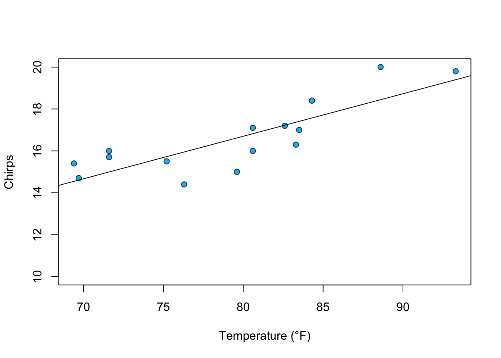

### Linear Regression

```r
#Print the model summary 
summary(myModel)
```

```
## 
## Call:
## lm(formula = chirps ~ temp)
## 
## Residuals:
##     Min      1Q  Median      3Q     Max 
## -1.6181 -0.6154  0.0916  0.7669  1.5549 
## 
## Coefficients:
##             Estimate Std. Error t value Pr(>|t|)    
## (Intercept)  0.45931    2.98920   0.154 0.880239    
## temp         0.20300    0.03754   5.408 0.000119 ***
## ---
## Signif. codes:  0 '***' 0.001 '**' 0.01 '*' 0.05 '.' 0.1 ' ' 1
## 
## Residual standard error: 0.986 on 13 degrees of freedom
## Multiple R-squared:  0.6923,	Adjusted R-squared:  0.6686 
## F-statistic: 29.25 on 1 and 13 DF,  p-value: 0.0001195
```

### Conclusions
* The p-value for temperature is less than the 95% threshold (0.05) which indicates the relationship is statistically significant.
* The adjusted R-squared is 0.67. About 70% of the variation in chirps can be explained by temperature. 
* The equation for the line of best fit is $Chirps = 0.2(Temperature) + 0.46$


## Hardy-Weinberg Genotype and Phenotype Solver

### Topics
* Concatenated print statements
* Rounding

### Calculations and Results

```r
#Enter count for each genotype
RR = 15
Rr = 5
rr = 10

#Find population total (used in later calculations)
n<-RR+Rr+rr

#Print Population Count
cat("Population Size = ", n, "\n")
```

```
## Population Size =  30
```

```r
#=======================================================
#GENOTYPE FREQUENCIES
#=======================================================
#Generate Genotype Frequencies
freq_RR<-RR/n
freq_Rr<-Rr/n
freq_rr<-rr/n

#Print Genotype Frequencies
cat("Frequency for genotype RR = ", round(freq_RR, digits=2), "\n")
```

```
## Frequency for genotype RR =  0.5
```

```r
cat("Frequency for genotype Rr = ", round(freq_Rr, digits=2), "\n")
```

```
## Frequency for genotype Rr =  0.17
```

```r
cat("Frequency for genotype rr = ", round(freq_rr, digits=2), "\n")
```

```
## Frequency for genotype rr =  0.33
```

```r
#=======================================================
#ALLELE COUNTS & FREQUENCIES
#=======================================================
#Generate Allele Counts
allele_R<-(RR*2)+Rr
allele_r<-Rr+(rr*2)
allele_all<-(RR*2)+(Rr*2)+(rr*2)

#Print Allele Counts
cat("Count for allele R = ", allele_R, "\n")
```

```
## Count for allele R =  35
```

```r
cat("Count for allele r = ", allele_r, "\n")
```

```
## Count for allele r =  25
```

```r
cat("Total Allele Count = ", allele_R + allele_r, "\n")
```

```
## Total Allele Count =  60
```

```r
#Generate Allele Frequencies
freq_R<-allele_R/allele_all
freq_r<-allele_r/allele_all

#Print Allele Frequencies
cat("Frequency for allele R = ", round(freq_R, digits=2), "\n")
```

```
## Frequency for allele R =  0.58
```

```r
cat("Frequency for allele r = ", round(freq_r, digits=2), "\n")
```

```
## Frequency for allele r =  0.42
```

```r
#=======================================================
#PHENOTYPE FREQUENCIES
#=======================================================
#Generate Phenotype Frequencies
freq_Red<-(RR+Rr)/n
freq_Yellow<-rr/n

#Print Phenotype Frequencies
cat("Frequency for Phenotype Red = ", round(freq_Red, digits=2), "\n")
```

```
## Frequency for Phenotype Red =  0.67
```

```r
cat("Frequency for Phenotype Yellow = ", round(freq_Yellow, digits=2), "\n")
```

```
## Frequency for Phenotype Yellow =  0.33
```

## Sea Anemone Body Mass vs Egg Count
### Topics
* Simple data entry
* Correlation
* Linear Regression

### Source
Data provided courtesy of Will Ryan, PhD, FSU Biology. Thesis: "The role of seasonal and geographic temperature variation on the life cycle of the clonal sea anemone *Diadumene lineata* (Verrill 1869)."

### Data Entry

```r
#Sea anemone body mass (g)
mass<-c(3.394,20.718, 7.836, 5.302, 12.438, 10.482, 5.233, 12.47 ,15.247)

#Sea anemone egg count
eggs<-c(72, 3298, 595, 194, 1924, 1606, 560, 1888, 2901)
```

### Correlation Analysis

```r
cor(mass,eggs)
```

```
## [1] 0.9775228
```

### Linear Regression 

```r
model<-lm(eggs~mass)

#Print the results of the linear regression model
summary(model)
```

```
## 
## Call:
## lm(formula = eggs ~ mass)
## 
## Residuals:
##     Min      1Q  Median      3Q     Max 
## -336.37 -215.27   44.44  129.45  442.68 
## 
## Coefficients:
##             Estimate Std. Error t value Pr(>|t|)    
## (Intercept)   -683.1      194.8  -3.508  0.00989 ** 
## mass           206.0       16.8  12.267 5.48e-06 ***
## ---
## Signif. codes:  0 '***' 0.001 '**' 0.01 '*' 0.05 '.' 0.1 ' ' 1
## 
## Residual standard error: 263.8 on 7 degrees of freedom
## Multiple R-squared:  0.9556,	Adjusted R-squared:  0.9492 
## F-statistic: 150.5 on 1 and 7 DF,  p-value: 5.484e-06
```

```r
cf <- round(coef(model), 2) 

#print out the formula for the model
as.formula(
  paste0("y ~ ", round(coefficients(model)[1],2), " + ", 
    paste(sprintf("%.2f * %s", 
                  coefficients(model)[-1],  
                  names(coefficients(model)[-1])), 
          collapse=" + ")
  )
)
```

```
## y ~ -683.14 + 206.04 * mass
```

### Scatterplot

```r
plot(mass,eggs,main="Sea Anemone Egg Count vs Body Mass (g)", ylab="Eggs", xlab="Body Mass (g)", pch=19,cex=1,bg=3,col="black", ylim=c(0,3500), xlim=c(0,25))

#Plot the line of best fit from the linear regression model; set line to dashed style
abline(model,lty=1, col="blue")

abline(v = 3.32, lty=2, col="red")
abline(h = 0, lty=3, col="grey28")
```

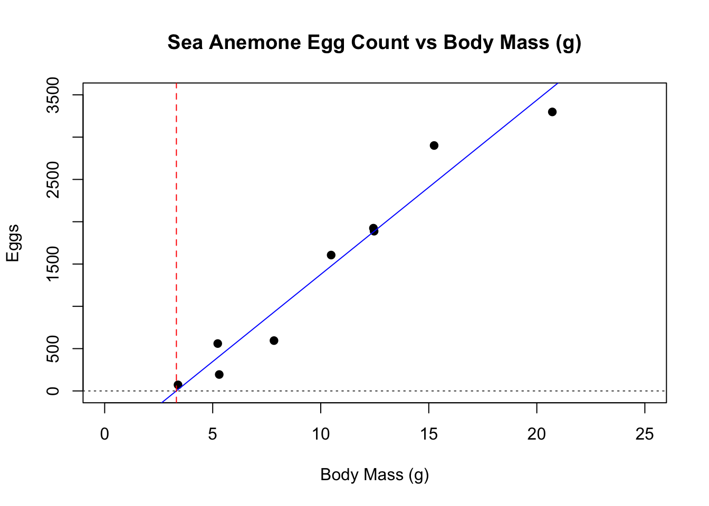

## Simple Clustering by Characteristics
Cluster analysis works by grouping organisms that are closest to each other by using the distance formula. This can work for 2D (x,y) coordinates, 3D (x,y,z) coordinates, or coordinates in even more dimensions. Here, we can examine the closeness of several species using measurements. Our coordinates will have multiple dimensions, but this doesn't matter. NOTE: Cluster analysis is somewhat subjective and the number of clusters is ultimately at the discretion of the researcher! Results are therefore not absolutely conclusive and should be considered along with other data.

### Data Entry

```r
#The data should be entered so the values at each position represent the same information for all species
#in order: Vertebral column, Hinged jaw, Four walking legs, Amniotic (shelled) egg, Hair
# 1 means Yes, 0 means No.

Lamprey   <-c(1,0,0,0,0)
Lancelet  <-c(0,0,0,0,0)
Leopard   <-c(1,1,1,1,1)
Salamander<-c(1,1,1,0,0)
Tuna      <-c(1,1,0,0,0)
Turtle    <-c(1,1,1,1,0)
#Dolphin   <-c() #optional -- add your own new species

#Store all species data sets together
df<-data.frame(Lamprey,Lancelet,Leopard,Salamander,Tuna,Turtle)

#update the data frame if the list of species changed
#df<-data.frame(Lamprey,Lancelet,Leopard,Salamander,Tuna,Turtle,Dolphin)

#Transpose the data set so the names are on the rows instead of columns
tDF<-t(df)
```

### Calculations

```r
#Calculate the distance matrix
d <- dist(tDF,method="euclidean")

#Run a clustering method
hc <- hclust(d, method="ward.D")
```

### Plotting a Dendrogram

```r
#Plot the dendrogram
plot(as.dendrogram(hc),horiz=FALSE)
```


## Simple T-test and Descriptive Statistics

### Data Entry

```r
#Fish length data for two lakes
dugout<-c(6.3, 4.8, 4.6, 4.2, 3.8, 5.5, 4.2, 5.9, 3.3, 4.3, 2.9, 5.7, 4.8, 5.2, 4.3, 3.9, 4.9, 5.2, 3.6, 4.5, 4.1, 3.4, 5, 4.9, 4.1, 4.4, 3.1, 5.4, 4.5, 3.5)
ormond<-c(4.6, 5, 5.2, 6.7, 3.9, 6.4, 5.9, 3.9, 5.8, 3.7, 6.5, 6.6, 3.7, 4, 5.7, 6.7, 4.4, 6.1, 3.5, 6, 4.9, 6.3, 5.9, 3.3, 5, 5.6, 5.5, 5.8, 3.4, 5.6)
```

### T-test

```r
#conduct a t-test to compare the means of each data set
#this format for a t-test runs an independent t-test where both data sets are numeric.
t.test(dugout,ormond)
```

```
## 
## 	Welch Two Sample t-test
## 
## data:  dugout and ormond
## t = -2.8129, df = 54.408, p-value = 0.006817
## alternative hypothesis: true difference in means is not equal to 0
## 95 percent confidence interval:
##  -1.2159643 -0.2040357
## sample estimates:
## mean of x mean of y 
##  4.476667  5.186667
```

### Simple Descriptive Statistics

```r
#calculate the sample size and print it out with some helpful text and a return to the next line
cat("Dugout Lake Sample Size = ", length(dugout), "\n")
```

```
## Dugout Lake Sample Size =  30
```

```r
#calculate the sample mean and print it out with some helpful text and a return to the next line
cat("Dugout Lake Sample Mean = ", mean(dugout), "\n")
```

```
## Dugout Lake Sample Mean =  4.476667
```

```r
#calculate the sample standard deviation and print it out with some helpful text and a return to the next line
cat("Dugout Lake Sample Standard Deviation = ", sd(dugout), "\n")
```

```
## Dugout Lake Sample Standard Deviation =  0.84269
```

```r
#calculate the sample standard error and print it out with some helpful text and a return to the next line
cat("Dugout Lake Sample Standard Error = ",sd(dugout)/sqrt(length(dugout)), "\n")
```

```
## Dugout Lake Sample Standard Error =  0.1538534
```

```r
#calculate the sample size and print it out with some helpful text and a return to the next line
cat("Ormond Lake Sample Size = ", length(ormond), "\n")
```

```
## Ormond Lake Sample Size =  30
```

```r
#calculate the sample mean and print it out with some helpful text and a return to the next line
cat("Ormond Lake Sample Mean = ", mean(ormond), "\n")
```

```
## Ormond Lake Sample Mean =  5.186667
```

```r
#calculate the sample standard deviation and print it out with some helpful text and a return to the next line
cat("Ormond Lake Sample Standard Deviation = ", sd(ormond), "\n")
```

```
## Ormond Lake Sample Standard Deviation =  1.095991
```

```r
#calculate the sample standard error and print it out with some helpful text and a return to the next line
cat("Ormond Lake Sample Standard Error = ",sd(ormond)/sqrt(length(ormond)), "\n")
```

```
## Ormond Lake Sample Standard Error =  0.2000996
```

### Bar Chart with Error Bars

```r
#Calculate the means for both samples and store the values 
means <- c(mean(dugout), mean(ormond))

#Create a couple of names for later use in a bar chart
names <- c("Dugout", "Ormond")

#Calculate the standard error for each lake and store it
seDugout<-sd(dugout)/sqrt(length(dugout))
seOrmond<-sd(ormond)/sqrt(length(ormond))
standardErrors <- c(seDugout, seOrmond)

#find the upper limit of the standard error for both samples
plotTop <- max(means+standardErrors*2)

colorDugout<-"#00BBFF"
colorOrmond<-"#FF3300"

#plot a bar chart and store it so it can receieve error bars
barCenters <- barplot(means, names.arg=names,las=1, ylim=c(0,plotTop), col=c(colorDugout,colorOrmond))

#add error bars to the bar chart
arrows(barCenters, means-standardErrors*2, barCenters, means+standardErrors*2, lwd=2, angle=90, code=3)
```

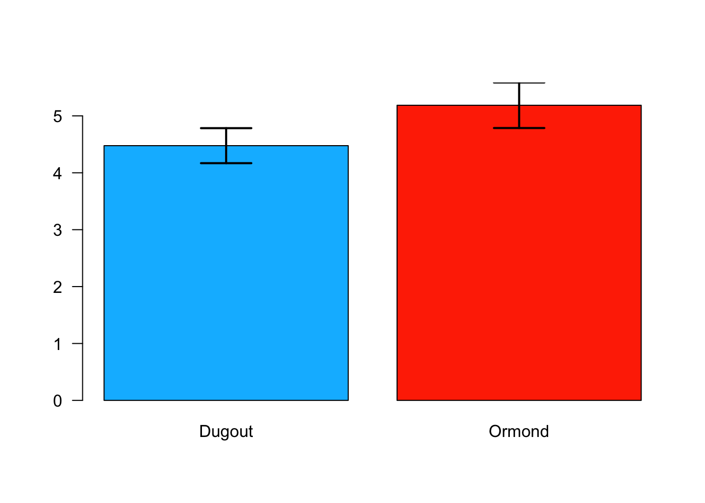


## Genetic Drift

### Data Entry

```r
library(stringr)

generation0<-c("Aa","Aa","aa","Aa","AA","Aa","aa","Aa","Aa","aa","AA","aa","Aa","aa","AA","Aa","aa","AA","Aa","aa")
generation1<-c("AA","aa","Aa","aa","AA","Aa","aa","AA","Aa","aa","Aa","Aa","aa","Aa","AA","Aa","Aa","Aa","Aa","aa")
generation2<-c("Aa","Aa","aa","Aa","AA","Aa","Aa","Aa","Aa","aa","aa","AA","aa","AA","AA","Aa","aa","Aa","Aa","AA")
generation3<-c("aa","AA","aa","AA","AA","Aa","aa","Aa","Aa","AA","aa","AA","aa","AA","AA","Aa","aa","Aa","Aa","AA")
generation4<-c("Aa","Aa","Aa","Aa","Aa","Aa","Aa","Aa","Aa","aa","Aa","Aa","Aa","Aa","aa","Aa","Aa","Aa","aa","Aa")
generation5<-c("aa","AA","aa","Aa","Aa","AA","AA","Aa","AA","Aa","aa","aa","AA","Aa","Aa","aa","aa","Aa","Aa","aa")
generation6<-c("Aa","Aa","aa","Aa","Aa","Aa","AA","aa","Aa","aa","AA","Aa","Aa","AA","AA","Aa","aa","AA","Aa","aa")
generation7<-c("Aa","Aa","Aa","Aa","aa","AA","Aa","Aa","aa","AA","AA","aa","Aa","aa","aa","AA","aa","AA","Aa","aa")
generation8<-c("aa","aa","aa","Aa","Aa","Aa","aa","AA","Aa","aa","Aa","AA","aa","Aa","Aa","Aa","Aa","aa","Aa","aa")
generation9<-c("Aa","aa","Aa","Aa","aa","Aa","AA","Aa","Aa","AA","Aa","Aa","AA","AA","aa","Aa","Aa","Aa","AA","Aa")

#Gather the data into a data frame
data0<-data.frame(string=c(generation0), stringsAsFactors=F)
data1<-data.frame(string=c(generation1), stringsAsFactors=F)
data2<-data.frame(string=c(generation2), stringsAsFactors=F)
data3<-data.frame(string=c(generation3), stringsAsFactors=F)
data4<-data.frame(string=c(generation4), stringsAsFactors=F)
data5<-data.frame(string=c(generation5), stringsAsFactors=F)
data6<-data.frame(string=c(generation6), stringsAsFactors=F)
data7<-data.frame(string=c(generation7), stringsAsFactors=F)
data8<-data.frame(string=c(generation8), stringsAsFactors=F)
data9<-data.frame(string=c(generation9), stringsAsFactors=F)
```

### Calculations

```r
#Count the A alleles in each data set
data0$countA <- str_count(data0$string, "A")
data1$countA <- str_count(data1$string, "A")
data2$countA <- str_count(data2$string, "A")
data3$countA <- str_count(data3$string, "A")
data4$countA <- str_count(data4$string, "A")
data5$countA <- str_count(data5$string, "A")
data6$countA <- str_count(data6$string, "A")
data7$countA <- str_count(data7$string, "A")
data8$countA <- str_count(data8$string, "A")
data9$countA <- str_count(data9$string, "A")

#Count the a alleles in each data set
data0$counta <- str_count(data0$string, "a")
data1$counta <- str_count(data1$string, "a")
data2$counta <- str_count(data2$string, "a")
data3$counta <- str_count(data3$string, "a")
data4$counta <- str_count(data4$string, "a")
data5$counta <- str_count(data5$string, "a")
data6$counta <- str_count(data6$string, "a")
data7$counta <- str_count(data7$string, "a")
data8$counta <- str_count(data8$string, "a")
data9$counta <- str_count(data9$string, "a")

#Sum up the A alleles for each generation
data0A<-sum(data0[2])
data1A<-sum(data1[2])
data2A<-sum(data2[2])
data3A<-sum(data3[2])
data4A<-sum(data4[2])
data5A<-sum(data5[2])
data6A<-sum(data6[2])
data7A<-sum(data7[2])
data8A<-sum(data8[2])
data9A<-sum(data9[2])

#Sum up the a alleles for each generation
data0a<-sum(data0[3])
data1a<-sum(data1[3])
data2a<-sum(data2[3])
data3a<-sum(data3[3])
data4a<-sum(data4[3])
data5a<-sum(data5[3])
data6a<-sum(data6[3])
data7a<-sum(data7[3])
data8a<-sum(data8[3])
data9a<-sum(data9[3])

#Gather the sums for each allele type for plotting a line
countTrendA<-c(data0A,data1A,data2A,data3A,data4A,data5A,data6A,data7A,data8A,data9A)
countTrenda<-c(data0a,data1a,data2a,data3a,data4a,data5a,data6a,data7a,data8a,data9a)

#Calculate the allele frequencies for each generation
freqTrendA<-countTrendA/(length(generation0)*2)
freqTrenda<-countTrenda/(length(generation0)*2)
```

### Plotting

```r
#Plot the allele frequency trends
plot(freqTrendA,type="o",ylim=c(0,1), main="Allele Frequency Trends", col="red", pch=2, ylab="Frequency", xlab="Generation")
points(freqTrenda,type="o", col="blue", pch=19)
legend("topright",c("A","a"),pch=c(2,19),col=c("red","blue"),lty=1)
```

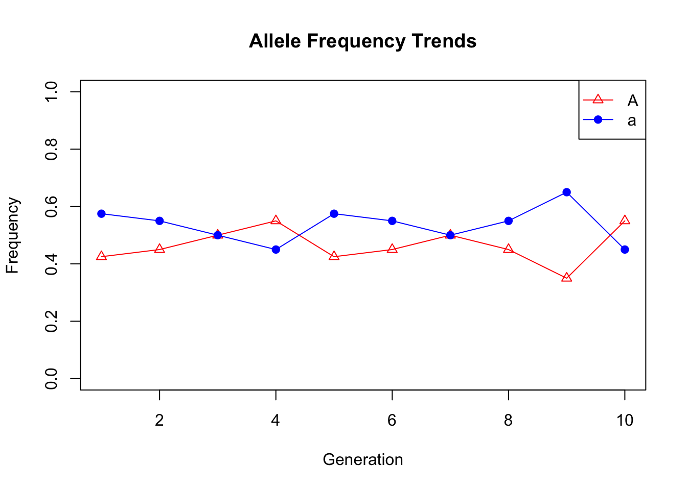

## Hominin Skull Analysis

### Data Entry

```r
#Age in Millions of Years Ago (MYA)
ageMYA   <-c(1.8,   0.1,    2.5,    0.0,    0.4,    3.0,    1.5)

#Brain Volume (cubic centimeters)
brainVol <-c(590,   1520,   485,    395,    1050,   400,    880)

#Jaw Length (cm)
jawLength<-c(NA,    6.6,    9.9,    6.9,    6.6,    8.7,    NA)

#Jaw Width (cm)
jawWidth <-c(NA,    3.5,    5.9,    5.3,    4.0,    5.4,    NA)

#Adult height (m)
height   <-c(1.5,   1.75,   1.4,    0.85,   1.8,    1.5,    1.7)

#Adult mass (kg)
mass     <-c(40,    70.2,   41,     56.6,   65.6,   45,     68)

#Gather all data into a data frame
features<-data.frame(ageMYA,brainVol,jawLength,jawWidth,height,mass)

#Add names to the rows
rownames(features)<-c("skullA","skullB","skullC","skullD","skullE","skullF","skullG")

#sort the data frame by age so we can plot the line in the right order
features <- features[order(ageMYA) , ]
```

### Plotting

```r
#plot some scatter plots with lines of best fit from linear regression models
plot(features$ageMYA,features$brainVol,cex=2, pch=19, ylim=c(min(features$brainVol),max(features$brainVol)),xlab="Age (MYA)",ylab="Brain Volume (cc)")
abline(lm(features$brainVol~features$ageMYA))
```

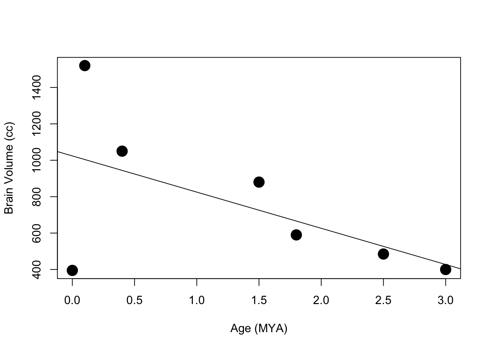

```r
plot(features$ageMYA,features$jawLength,  cex=2, pch=19, ylim=c(0,   10),xlab="Age (MYA)",ylab="Jaw Length (cm)")
abline(lm(features$jawLength~features$ageMYA))
```

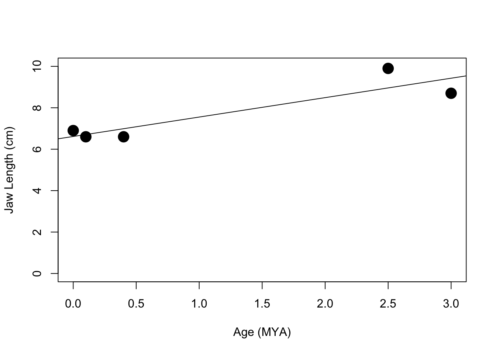

```r
plot(features$ageMYA,features$jawWidth,   cex=2, pch=19, ylim=c(0,    6),xlab="Age (MYA)",ylab="Jaw Width (cm)")
abline(lm(features$jawWidth~features$ageMYA))
```

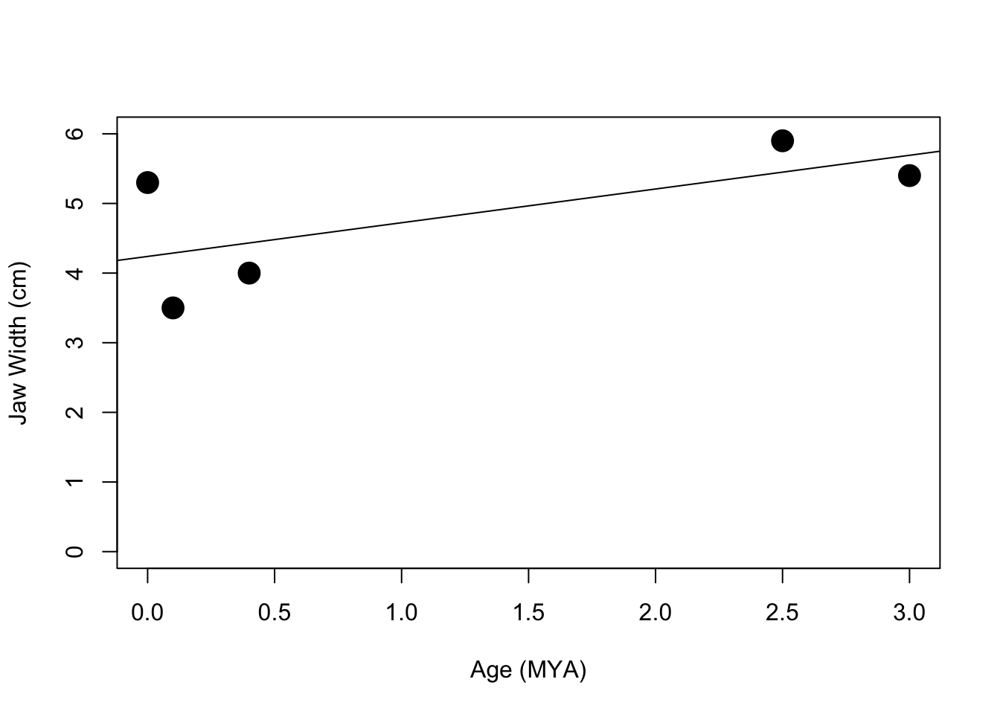

```r
plot(features$ageMYA,features$height,     cex=2, pch=19, ylim=c(min(features$height),      max(features$height)),xlab="Age (MYA)",ylab="Height (m)")
abline(lm(features$height~features$ageMYA))
```

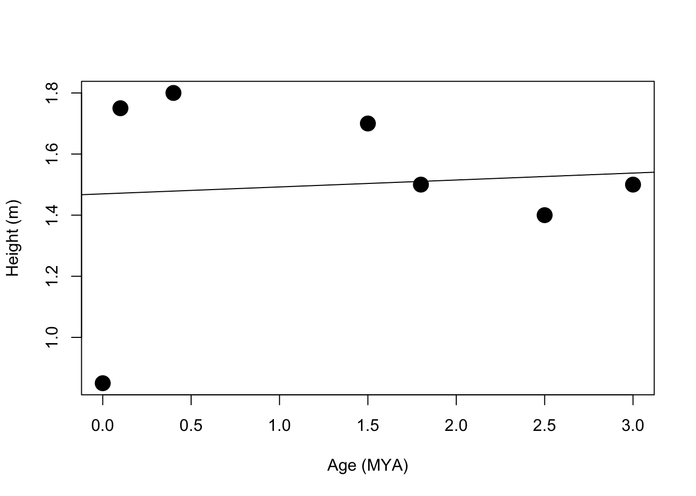

```r
plot(features$ageMYA,features$mass,       cex=2, pch=19, ylim=c(min(features$mass),        max(features$mass)),xlab="Age (MYA)",ylab="Mass (kg)")
abline(lm(features$mass~features$ageMYA))
```

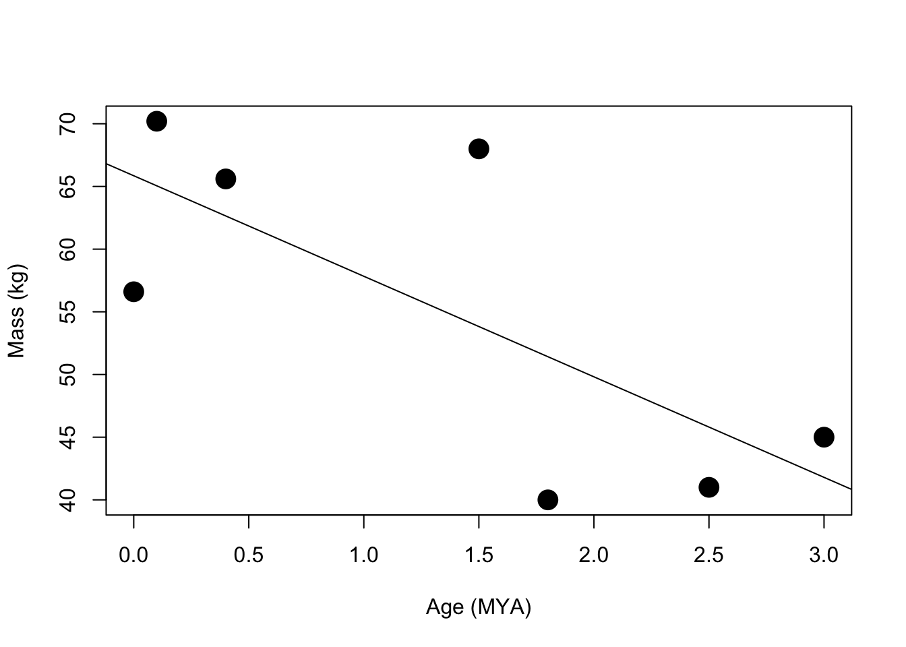

### Dendrogram

```r
#Calculate the distance matrix
matrix <- dist(features,method="euclidean")

#Run a clustering method
cluster <- hclust(matrix, method="ward.D")

#Plot the dendrogram
plot(as.dendrogram(cluster),horiz=FALSE)
```

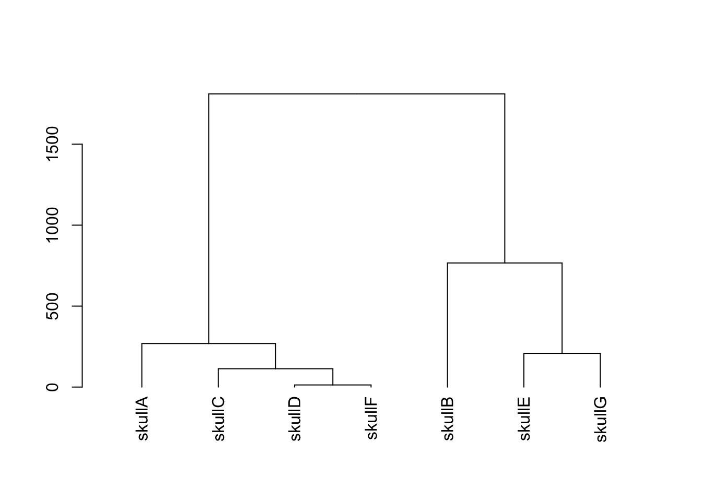


## Yellowstone Wolf Populations 

```r
#Enter years
year<-c(2001,2002,2003,2004,2005,2006,2007,2008,2009,2010,2011,2012,2013)

#Wolves
wolf<-c(57,69,77,89,134,175,188,178,224,246,230,194,211)

#Wolf Packs
pack<-c(8,8,10,11,13,27,25,30,30,34,38,30,31)

#Wolves killed for Livestock Control
wlc<-c(1,6,18,29,41,44,63,46,31,40,36,43,33)

#Wolves killed by Hunters
wkh<-c(0,0,0,0,0,0,0,0,0,0,0,66,62)


#create a scatter plot
plot(year,wolf,pch=19,type="o",ylim=c(0,250),main="Individual Wolves",ylab="Wolves")
abline(h=50,lty=2)
abline(h=100,lty=2)
abline(h=150,lty=2)
abline(h=200,lty=2)
```

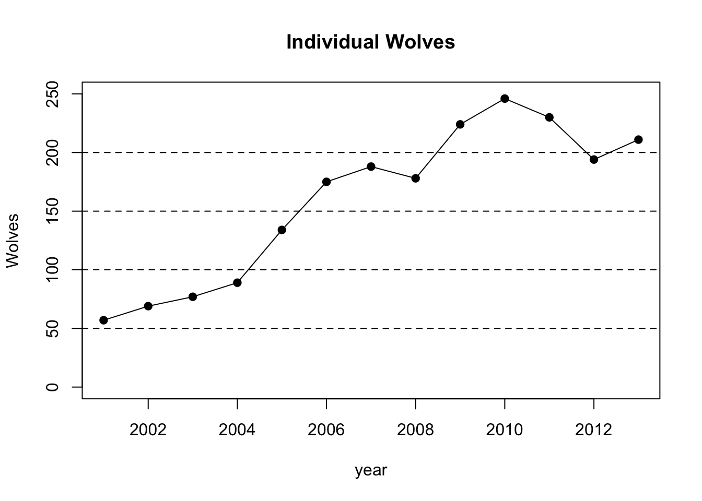

```r
plot(year,pack,pch=19,type="o",ylim=c(0,40),main="Wolf Packs",ylab="Packs")
abline(h=10,lty=2)
abline(h=20,lty=2)
abline(h=30,lty=2)
```

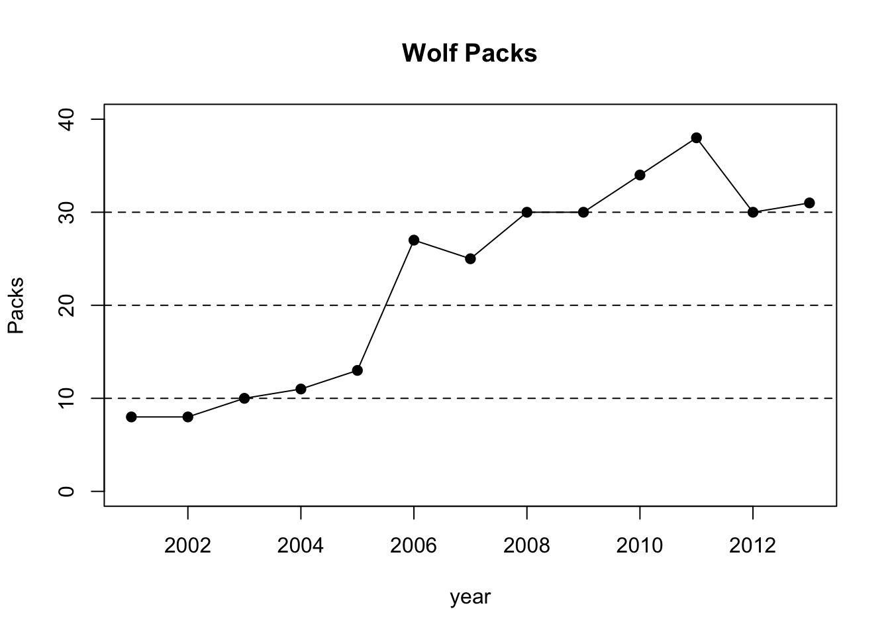

```r
plot(year,wlc,pch=19,type="o",ylim=c(0,70),main="Wolves Killed for Livestock Control",ylab="Wolves")
abline(h=30,lty=2)
abline(h=40,lty=2)
abline(h=50,lty=2)
abline(h=60,lty=2)
```

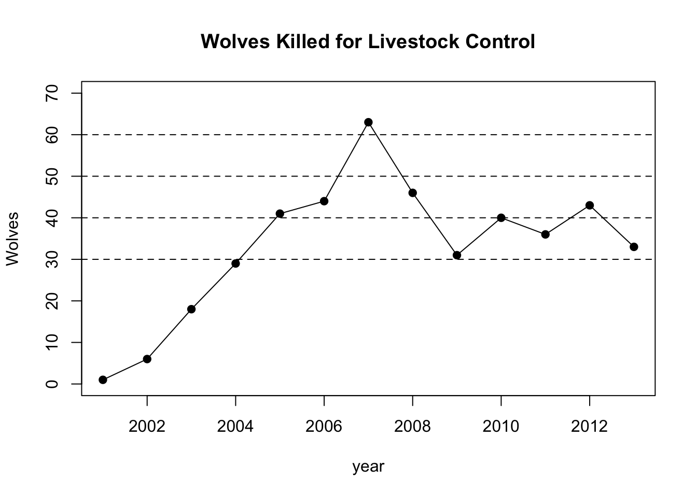

```r
plot(year,wkh,pch=19,type="b",ylim=c(0,70),main="Wolves Killed by Hunters",ylab="Wolves")
abline(h=60,lty=2)
```

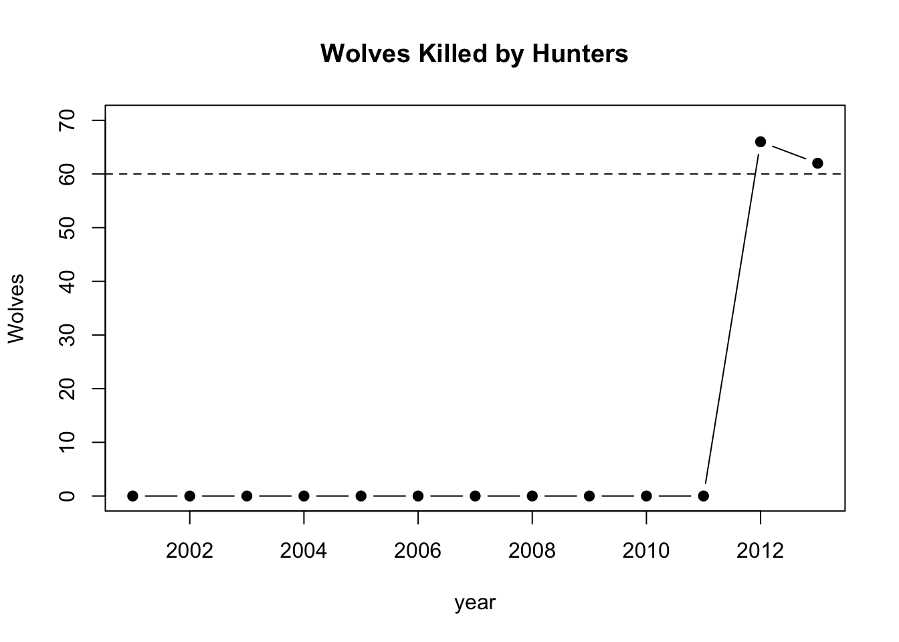

## Yellowstone Livestock Losses

```r
#Enter years
year<-c(2001,2002,2003,2004,2005,2006,2007,2008,2009,2010,2011,2012,2013)

#Wolves
cattle<-c(18,23,34,75,54,123,55,41,20,26,35,44,41)

#Wolf Packs
sheep<-c(34,0,7,18,27,38,16,26,195,33,30,112,33)

#create a scatter plot
plot(year,cattle,pch=15,type="o",ylim=c(0,200),main="Cattle Killed by Wolves",ylab="Cattle",col=1)
points(year,sheep,pch=22,type="o",main="Sheep Killed by Wolves",ylab="Sheep", col=1)

#Add a legend
legend(2002,200,c("Cattle","Sheep"),col=c(1,1),pch=c(15,22))
```

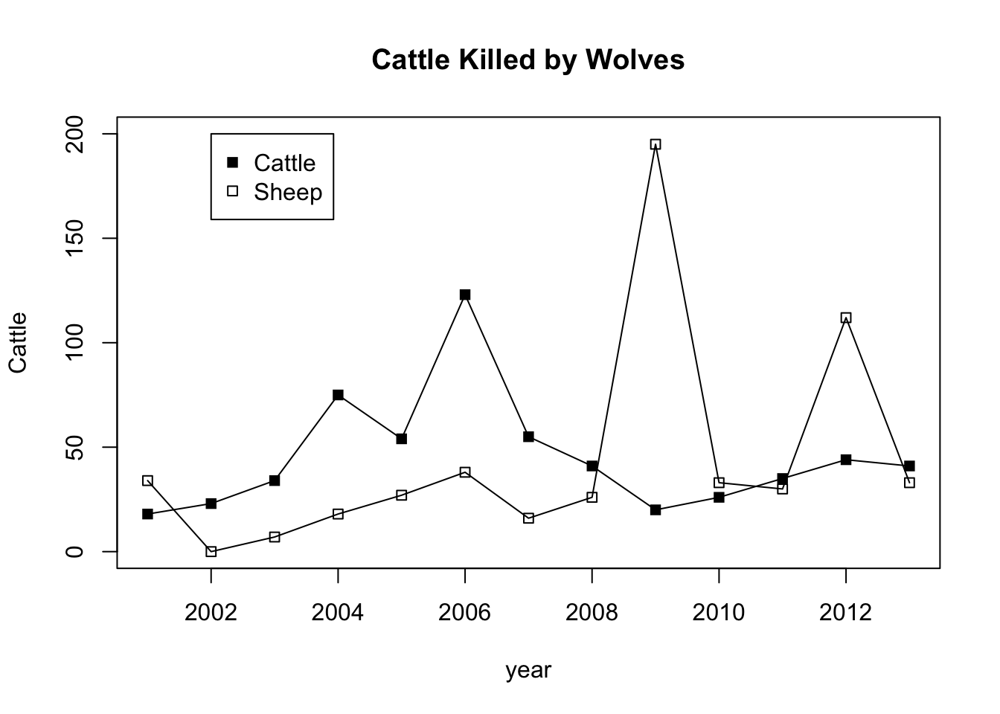

## Yellowstone Elk Populations

```r
#Enter years
year<-c(1994,1995,1996,1997,1998,1999,2000,2001,2002,2003,2004,2005,2006,2007,2008,2009,2010,2011,2012)

#Enter elk for each year
elk<-c(19045,16791,NA,NA,11742,14538,13400,11969,9215,9215,8335,9545,6588,6738,6279,6070,4635,4174,3915)

#create a scatter plot of elk per year and set some parameters for the graph, including a grid.
plot(year,elk,pch=19,type="o",ylim=c(0,20000),main="Elk Population Size by Year")
abline(h=5000,lty=2)
abline(h=10000,lty=2)
abline(h=15000,lty=2)
```

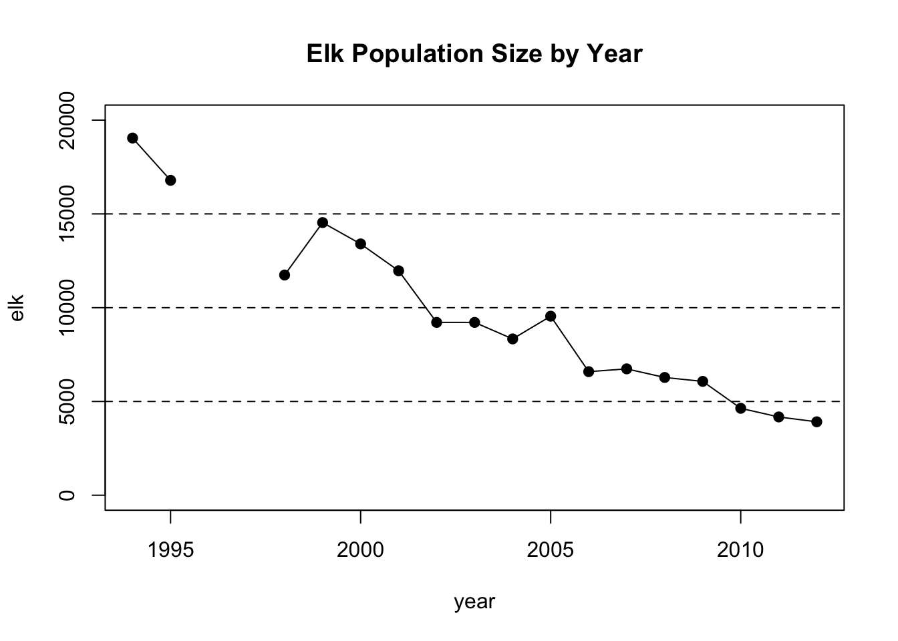


## Temperature Measurement Error

```r
#Enter each group's temperature data gathered using hands. You'll need to replace the example numbers below.
#group1,group2,group3, etc. (order is not important in this analysis!)
hands<-c(55,60,64,63,67,64,64,78,67,65,85,67,70)

#Enter each group's temperature data gathered using a sticker-type thermometer
sticker<-c(60,62,70,65,63,58,71,64,65,65,70,62,55)

#Enter each group's temperature data gathered using a traditional thermometer
thermometer<-c(98,99,96,97,97,98,99,94,93,92,94,98,96)

#Gather all of the data together into one location
allTheData<-data.frame(hands, sticker, thermometer)

#Summarize the data in the 
summary(allTheData)
```

```
##      hands          sticker       thermometer   
##  Min.   :55.00   Min.   :55.00   Min.   :92.00  
##  1st Qu.:64.00   1st Qu.:62.00   1st Qu.:94.00  
##  Median :65.00   Median :64.00   Median :97.00  
##  Mean   :66.85   Mean   :63.85   Mean   :96.23  
##  3rd Qu.:67.00   3rd Qu.:65.00   3rd Qu.:98.00  
##  Max.   :85.00   Max.   :71.00   Max.   :99.00
```

```r
#Make a boxplot with all of your data. Abbreviate hands(h), sticker(s), and thermometer(t) so the labels fit easily.
boxplot(allTheData, names=c("Hands","Sticker","Thermometer"))
```

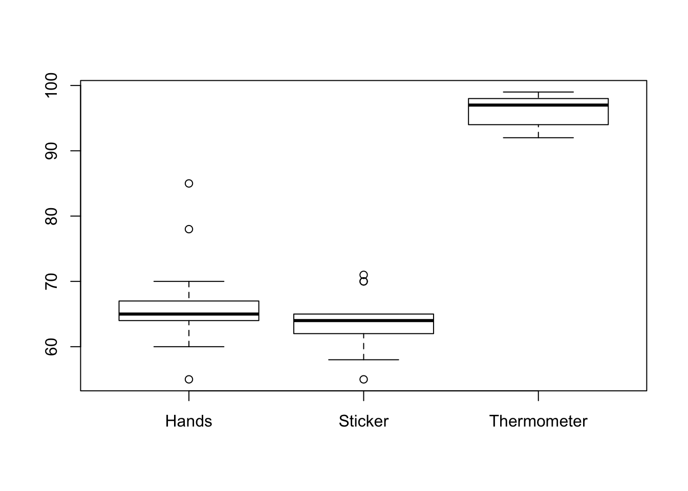

```r
#Set up a grid so you can see multiple plots at the same time (rows, columns)
par(mfrow=c(3,1))

#set up the range (min,max) and interval for the histogram x axis
breakCount=seq(40,100,by=1)

#Set up the y axis limit
yMax=5

#Make a histogram for each of the three methods 
hist(hands,       col=rgb(0.81,0.21,0.21), breaks=breakCount, ylim=c(0,yMax), main="Hands",       xlab=expression(paste("Temperature, ",degree,"C"))) 
hist(sticker,     col=rgb(0.61,0.82,0.21), breaks=breakCount, ylim=c(0,yMax), main="Sticker",     xlab=expression(paste("Temperature, ",degree,"C")))
hist(thermometer, col=rgb(0.21,0.39,0.56), breaks=breakCount, ylim=c(0,yMax), main="Thermometer", xlab=expression(paste("Temperature, ",degree,"C")))
```

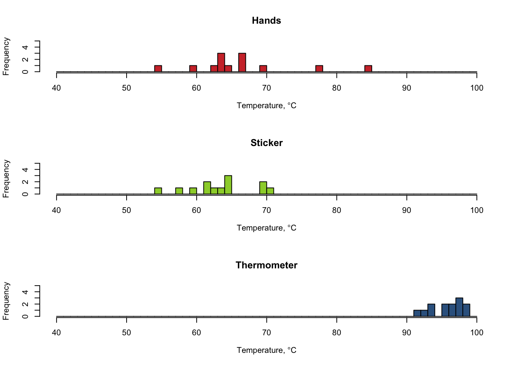

## Shannon-Weiner Index and Species Evenness

```r
#Enter your plant coverage percentage as a whole number for each species or type. 
p<-c(10,20,60,10)

#Convert values to decimals by dividing everything by 100
p<-p/100

#calculate the natural log for each value at each location and store the result. This is ln(p).
lnp<-log(p)

#calculate p*ln(p) and store the values.
plnp<-p*lnp

#calculate the negative summation of p*ln(p)
H<--1*sum(plnp)

#calculate maximum possible diversity using sample size
hMax<-log(length(p))

#calculate species evenness by dividing the Shannon-Weiner index by Maximum possible diversity
evenness<-H/hMax

#Print the results with a return for the next line
cat("Sample Site Shannon-Weiner Index = ", H, "\n")
```

```
## Sample Site Shannon-Weiner Index =  1.0889
```

```r
cat("Sample Site Species Evenness = ", evenness, "\n")
```

```
## Sample Site Species Evenness =  0.7854753
```

## Natural Selection and Phenotype

```r
#Enter With Selection or Without Selection as a title, depending on your group.
title<-"With Selection"

#Enter FREQUENCY data for each color of mouse.
#Data, in order, represent the frequency of each color at the Start, after Round 1, after Reproduction, and after Round 2.
#The format is: colorX<-c(Initial, After Round 1, After Reproduction, After Round 2)

color1<-c(0.25,0.30,0.25,0.45)
color2<-c(0.25,0.15,0.10,0.05)
color3<-c(0.25,0.30,0.35,0.25)
color4<-c(0.25,0.30,0.30,0.25)

#Create a grid to display four graphs on a 2x2 grid
par(mfrow=c(2,2))

#Plot bar graphs of each
barplot(color1, main=title, xlab="Color 1",ylim=c(0,1), col="antiquewhite")
barplot(color2, main=title, xlab="Color 2",ylim=c(0,1), col="tan")
barplot(color3, main=title, xlab="Color 3",ylim=c(0,1), col="tan3")
barplot(color4, main=title, xlab="Color 4",ylim=c(0,1), col="tan4")
```

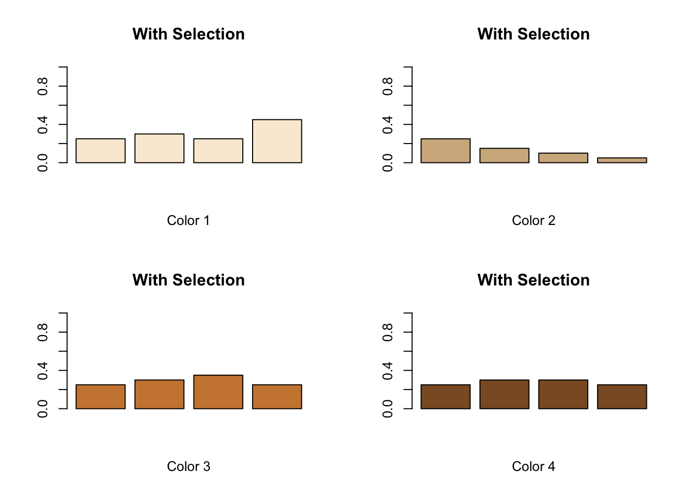

## Population Growth Curve


```r
#set up time (days,years,etc), initial population size, K, and r values
initialPopulationSize=100
days=50
K=500
r=0.3

#set up time and population array sizes
N<-array(dim=days+1)
t<-array(dim=days+1)

#set up the initial value in each array for population and time
N[1]=initialPopulationSize
t[1]=0

#loop through each value of the population array
for (i in 1:days)
{
    #tapering growth curve
    N[i+1]<-N[i]+r*N[i]*((K-N[i])/K)

    #exponential growth curve
    #N[i+1]<-N[i]+r*N[i]

    #increment time value by 1
    t[i+1]=t[i]+1
}

#organize the output into a data frame and print it
myData <- data.frame(t=t,N=N)
myData
```

```
##     t        N
## 1   0 100.0000
## 2   1 124.0000
## 3   2 151.9744
## 4   3 183.7090
## 5   4 218.5723
## 6   5 255.4797
## 7   6 292.9617
## 8   7 329.3542
## 9   8 363.0760
## 10  9 392.9043
## 11 10 418.1513
## 12 11 438.6864
## 13 12 454.8248
## 14 13 467.1529
## 15 14 476.3597
## 16 15 483.1165
## 17 16 488.0105
## 18 17 491.5211
## 19 18 494.0216
## 20 19 495.7937
## 21 20 497.0450
## 22 21 497.9262
## 23 22 498.5458
## 24 23 498.9808
## 25 24 499.2859
## 26 25 499.4998
## 27 26 499.6497
## 28 27 499.7547
## 29 28 499.8283
## 30 29 499.8798
## 31 30 499.9158
## 32 31 499.9411
## 33 32 499.9588
## 34 33 499.9711
## 35 34 499.9798
## 36 35 499.9859
## 37 36 499.9901
## 38 37 499.9931
## 39 38 499.9951
## 40 39 499.9966
## 41 40 499.9976
## 42 41 499.9983
## 43 42 499.9988
## 44 43 499.9992
## 45 44 499.9994
## 46 45 499.9996
## 47 46 499.9997
## 48 47 499.9998
## 49 48 499.9999
## 50 49 499.9999
## 51 50 499.9999
```

```r
#plot the values for population size against time
plot(t,N,type="l", col="blue", lwd=2, xlab="Day", ylab="Population Size (n)", main="Population Growth Curve")
```

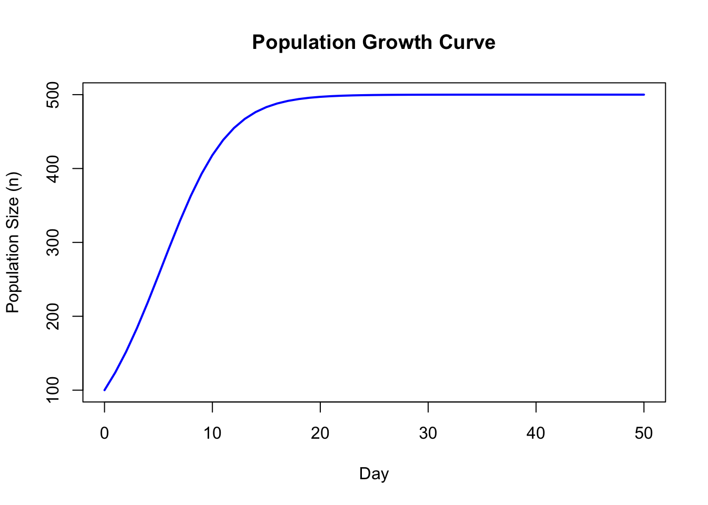

## Protozoa Growth

```r
#Enter data for the sample "Low Food, Dark"
LFD<-c(1,2,3,4,4,6,5,3,3,1)

#Enter data for the sample "Low Food, Light"
LFL<-c(1,2,4,8,12,15,18,12,8,6)

#Enter data for the sample "High Food, Dark"
HFD<-c(2,4,6,8,9,12,14,15,17,19)

#Enter data for the sample "High Food, Light"
HFL<-c(4,7,14,19,25,46,58,67,98,108)

#Enter the times (hours) at which you are sampling
age<-c(12,24,36,48,60,72,84,96,108,120)

#Change the scale factor for the point characters
scaleValue=2

#Create a scatter plot of Age and Low Food Dark data with default colors and symbols, add titles, set the range of the y axis, and connect the dots with a line
plot(age,LFD,xlab="Age (h)",ylab="Population", main="Protozoa Growth", ylim=c(0,110), type="o", cex=scaleValue)

#Add the remaining data sets and change the colors and symbols so they stand out
points(age, LFL,col=2,pch=2, type="o", cex=scaleValue)
points(age, HFD,col=3,pch=7, type="o", cex=scaleValue)
points(age, HFL,col=4,pch=8, type="o", cex=scaleValue)

#Create a legend for the graph and make sure the colors and symbols match
legend(10,100,c("LFD","LFL","HFD","HFL"),col=c(1,2,3,4),pch=c(1,2,7,8))
```

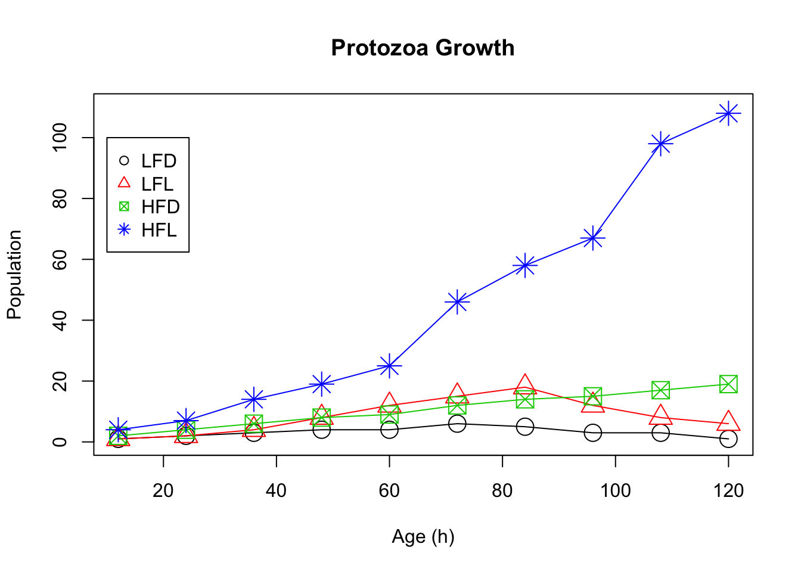

## Predator-Prey Relationships

```r
#Change the data below to match the number of rounds in your simulation. (e.g. for three rounds, use c(1,2,3))
Round    <-c(1,2,3,4,5,6,7,8,9,10,11,12,13,14,15,16,17,18,19,20,21,22,23,24,25,26,27,28,29,30,31,32,33,34,35,36)

#Enter your data for each of Deer, Resources, and Cougars below by replacing the example data with your own.
#For each, ensure you have one data point for each round of the simulation (e.g. 10 rounds should yield 10 data points for each of Deer, Resources, and Cougars)

Deer     <-c(1,2,3,4,5,6,7,6,5,4,3,2,1,2,3,4,5,6,7,8,7,6,5,4,3,2,1,2,3,4,5,6,7,8,7,6)

Resources<-c(9,8,7,6,5,6,7,8,4,5,6,7,6,5,4,3,4,5,6,7,8,6,6,5,4,3,2,3,4,5,6,7,8,9,8,6)

Cougars  <-c(1,2,3,2,3,2,3,2,4,5,3,4,2,3,4,5,6,5,4,5,6,7,6,7,8,9,8,7,6,5,6,5,4,3,4,5)

#Set the maximum y value (you can adjust this after you run the code once)
#Adjusting this value will help you see the trends more clearly
#Set the value to a little bit more than the maximum total for the best view 
yMax=25

#Put all data into one place (this will create a table)
allTheData<-data.frame(Deer,Resources,Cougars)

#print out the data table to check it
allTheData
```

```
##    Deer Resources Cougars
## 1     1         9       1
## 2     2         8       2
## 3     3         7       3
## 4     4         6       2
## 5     5         5       3
## 6     6         6       2
## 7     7         7       3
## 8     6         8       2
## 9     5         4       4
## 10    4         5       5
## 11    3         6       3
## 12    2         7       4
## 13    1         6       2
## 14    2         5       3
## 15    3         4       4
## 16    4         3       5
## 17    5         4       6
## 18    6         5       5
## 19    7         6       4
## 20    8         7       5
## 21    7         8       6
## 22    6         6       7
## 23    5         6       6
## 24    4         5       7
## 25    3         4       8
## 26    2         3       9
## 27    1         2       8
## 28    2         3       7
## 29    3         4       6
## 30    4         5       5
## 31    5         6       6
## 32    6         7       5
## 33    7         8       4
## 34    8         9       3
## 35    7         8       4
## 36    6         6       5
```

```r
#Sum across the rows to get the totals of Deer+Resources+Cougars at each stage
Total<-rowSums(allTheData)

#Create a scatter plot with lines. Type "o" determines the lines. 
plot(Round,Deer,xlab="Round",ylab="Population",main="Oh Deer!", ylim=c(0,yMax), type="o")

#Add data from other sources
points(Round, Resources,col=2,pch=2, type="o")
points(Round, Cougars,col=3,pch=3, type="o")
points(Round, Total,col=4,pch=4, type="o")

#Add a legend at (1,20)
legend(1,20,c("Deer","Resources","Cougars","Total"),col=c(1,2,3,4),pch=c(1,2,3,4))
```

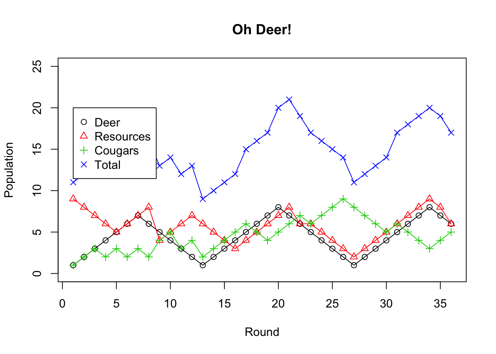

## Everglades Python Impact

```r
#Source: Dorcas, M. E., Willson, J. D., Reed, R. N., Snow, R. W., Rochford, M. R., Miller, M. A., … Hart, K. M. (2012). 
#Severe mammal declines coincide with proliferation of invasive Burmese pythons in Everglades National Park. 
#Proceedings of the National Academy of Sciences of the United States of America, 109(7), 2418–2422. http://doi.org/10.1073/pnas.1115226109

#Source: http://www.nps.gov/ever/learn/nature/burmesepythonremoval.htm
#Annual Tally of Burmese Pythons Removed In and Around Everglades National Park (Including Big Cypress, Everglades City, Marco Island, Key Largo, etc) by
#Authorized Agents*, Park Staff, and Park Partners
#Note: Compilation statistics were taken over by the U.S. Geological Survey in 2013

#Create data for the years on the x axis
year  <-c("1993","1994","1995","1996","1997","1998","1999","2000", "2001","2002","2003","2004","2005","2006","2007","2008","2009","2010","2011","2012")

#Create data vectors for each animal, filling in for missing data with NA
python <-c(NA,NA,NA,NA,NA,NA,NA,2, 3, 14,23,70,94,170,248,343,367,322,169,152)
deer   <-c(3, 4, 19,14,11,4, 9, NA,NA,NA,0,0,0,3,0,0,11,10,0,NA)
raccoon<-c(22,48,60,30,44,23,39,NA,NA,NA,0,3,2,1,0,0,0,0,3,NA)
opossum<-c(6, 21,23,12,18,14,9, NA,NA,NA,0,0,0,0,0,0,2,3,0,NA)
rabbit <-c(1, 1, 13,2, 13,3, 5, NA,NA,NA,0,0,0,0,0,0,0,0,0,NA)
bobcat <-c(3, 2, 1, 1, 0, 1, 1, NA,NA,NA,0,0,0,0,0,0,2,2,0,NA)

#Create multiple bar plots, one per organism with custom y axis limits
barplot(python, main="Python",xlab="Year", col=c("red"), names.arg=year, ylim=c(0,400))
```

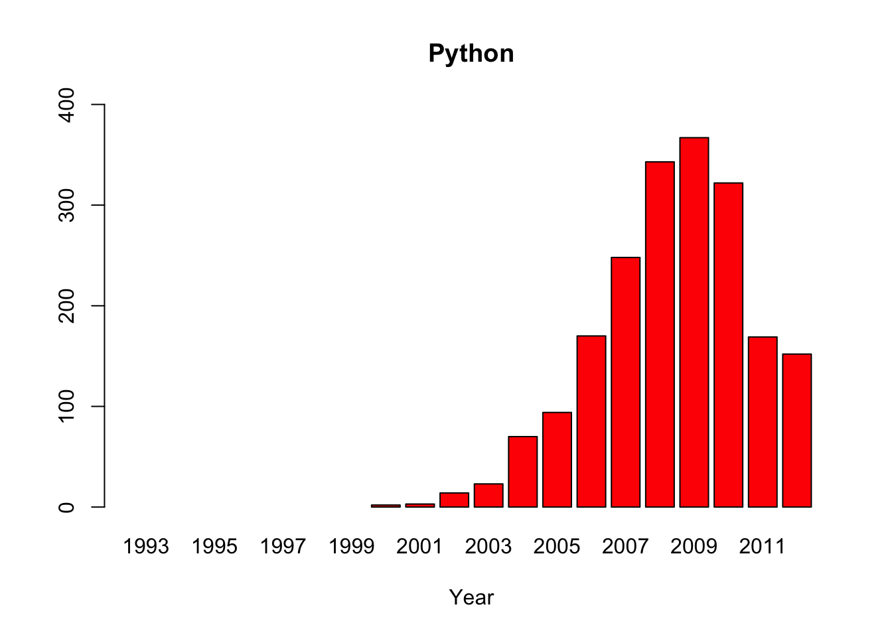

```r
barplot(deer, main="Deer",xlab="Year", col=c("red"), names.arg=year, ylim=c(0,20))
```

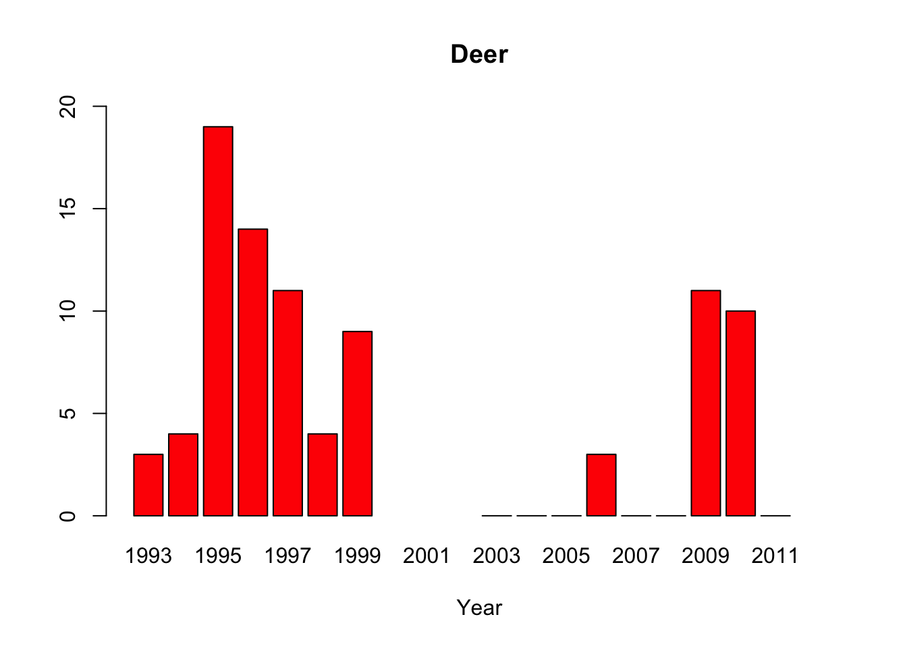

```r
barplot(raccoon, main="Raccoon",xlab="Year", col=c("red"), names.arg=year, ylim=c(0,65))
```

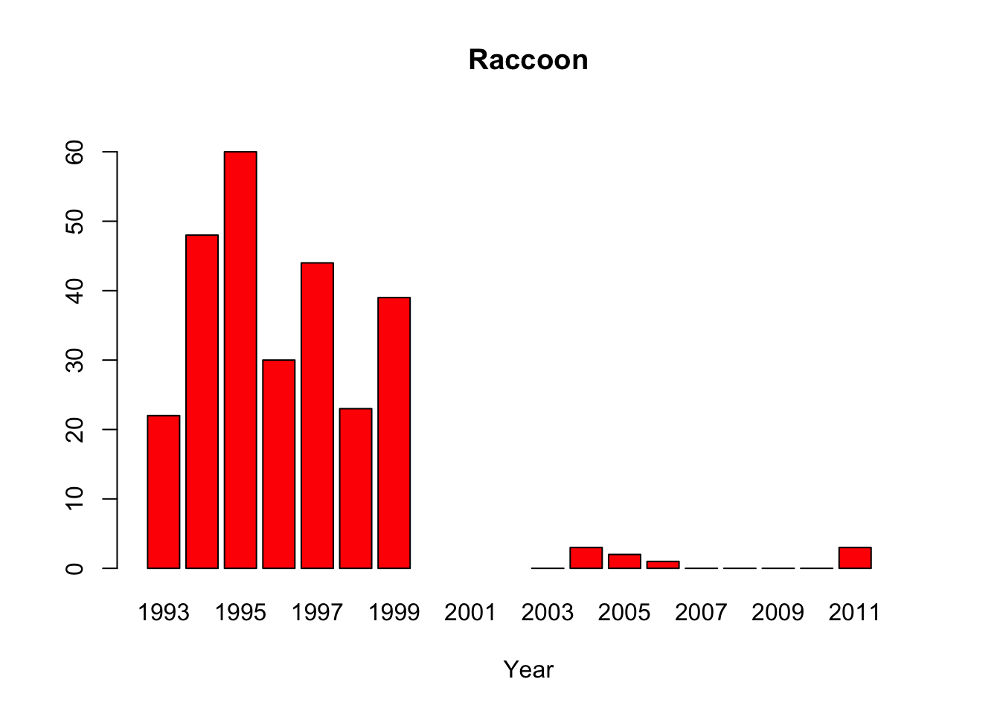

```r
barplot(opossum, main="Opossum",xlab="Year", col=c("red"), names.arg=year, ylim=c(0,25))
```


```r
barplot(rabbit, main="Rabbit",xlab="Year", col=c("red"), names.arg=year, ylim=c(0,15))
```

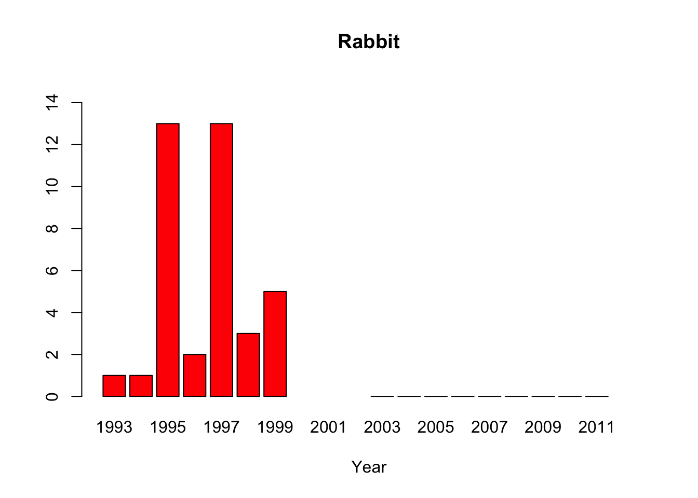

```r
barplot(bobcat, main="Bobcat",xlab="Year", col=c("red"), names.arg=year, ylim=c(0,5))
```

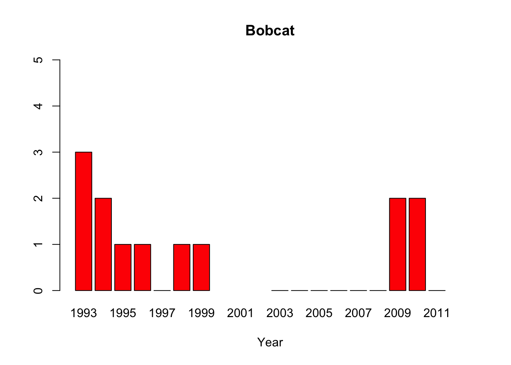

```r
#“All of the pythons that are captured in the park are actually removed from the park, so that precludes us from doing mark-recapture studies,” said lead author Michael Dorcas, in an interview with The Atlantic’s Brian Resnick. #Since park policy is to dispose of the invasive snake, the researchers do not have unassailable data on the python’s demographics. Their evidence of a population boom is a recorded surge in the number of snakes removed by rangers, #which is not, as they say “corrected for effort,” or for rangers’ sensitivity to the presence of the python. Their data on the python’s prey are similarly freighted.

#"Andrew Wyatt, president of the United States Association of Reptile Keepers was quick to point out the study’s weaknesses on NPR’s Diane Rehm Show on Wednesday. “The press and the media got quite carried away with the press #release and actually reported a number of things that are not detailed in the paper at all,” he said. “In the paper, there is no direct causation linked to the Burmese python, it’s speculative. There are numerous studies out there #that have been done in regards to mammal declines, and bird declines, in the Everglades that are linked back not to the Burmese python, but back to hydrology and high levels of mercury.”
#Source: http://www.esa.org/esablog/research/in-ecology-news-python-vs-the-everglades/
```

## Punnett Square Dice Simulation


```r
#Aa x Aa cross 
#Let's compare your group's genetics simulation results with the class and what is predicted by a Punnett square
#How does sample size affect the proximity of your results to the expected results?

#Group Data
#Enter the amount of each genotype
AA = 16
Aa = 25
aa = 9

#Class Data
#Enter the amount of each genotype
AA_class = 224
Aa_class = 514
aa_class = 262

#Enter expected frequencies
f_AA_exp=0.25
f_Aa_exp=0.5
f_aa_exp=0.25

#Calculate the expected ratio
ratio_exp = (f_AA_exp+f_Aa_exp)/f_aa_exp

#calculate phenotype frequencies using expected frequencies
f_Dominant_exp = f_AA_exp+f_Aa_exp
f_Recessive_exp = f_aa_exp
ratio_exp=f_Dominant_exp/f_Recessive_exp

#Calculate the genotype count sums for groups and class data
sum=AA+Aa+aa
sum_class=AA_class+Aa_class+aa_class

#Calculate genotype frequencies using group data
f_AA_group = AA/sum
f_Aa_group = Aa/sum
f_aa_group = aa/sum

#calculate phenotype frequencies using group data
f_Dominant_group = f_AA_group+f_Aa_group
f_Recessive_group = f_aa_group
ratio_group=f_Dominant_group/f_Recessive_group

#Calculate frequencies using class data
f_AA_class = AA_class/sum_class
f_Aa_class = Aa_class/sum_class
f_aa_class = aa_class/sum_class

#calculate phenotype frequencies using class data
f_Dominant_class = f_AA_class+f_Aa_class
f_Recessive_class = f_aa_class
ratio_class=f_Dominant_class/f_Recessive_class

#Print the expected results
cat("Expected AA genotype frequency = ",f_AA_exp, "\n")
```

```
## Expected AA genotype frequency =  0.25
```

```r
cat("Expected Aa genotype frequency = ", f_Aa_exp, "\n")
```

```
## Expected Aa genotype frequency =  0.5
```

```r
cat("Expected aa genotype frequency = ", f_aa_exp, "\n")
```

```
## Expected aa genotype frequency =  0.25
```

```r
cat("Expected Dominant phenotype frequency = ", f_Dominant_exp, "\n")
```

```
## Expected Dominant phenotype frequency =  0.75
```

```r
cat("Expected Recessive phenotype frequency = ", f_aa_exp, "\n")
```

```
## Expected Recessive phenotype frequency =  0.25
```

```r
cat("Expected Dominant:Recessive phenotype Ratio = ", ratio_exp, ": 1", "\n")
```

```
## Expected Dominant:Recessive phenotype Ratio =  3 : 1
```

```r
#Print the group data results
cat("Group AA genotype frequency = ",f_AA_group, "\n")
```

```
## Group AA genotype frequency =  0.32
```

```r
cat("Group Aa genotype frequency = ", f_Aa_group, "\n")
```

```
## Group Aa genotype frequency =  0.5
```

```r
cat("Group aa genotype frequency = ", f_aa_group, "\n")
```

```
## Group aa genotype frequency =  0.18
```

```r
cat("Group Dominant phenotype frequency = ", f_Dominant_group, "\n")
```

```
## Group Dominant phenotype frequency =  0.82
```

```r
cat("Group Recessive phenotype frequency = ", f_aa_group, "\n")
```

```
## Group Recessive phenotype frequency =  0.18
```

```r
cat("Group Dominant:Recessive phenotype Ratio = ", ratio_group,": 1", "\n")
```

```
## Group Dominant:Recessive phenotype Ratio =  4.555556 : 1
```

```r
#Print the class data results
cat("Class AA genotype frequency = ", AA_class/sum_class, "\n")
```

```
## Class AA genotype frequency =  0.224
```

```r
cat("Class Aa genotype frequency = ", Aa_class/sum_class, "\n")
```

```
## Class Aa genotype frequency =  0.514
```

```r
cat("Class aa genotype frequency = ", aa_class/sum_class, "\n")
```

```
## Class aa genotype frequency =  0.262
```

```r
cat("Class Dominant phenotype frequency = ", f_Dominant_class, "\n")
```

```
## Class Dominant phenotype frequency =  0.738
```

```r
cat("Class Recessive phenotype frequency = ", f_aa_class, "\n")
```

```
## Class Recessive phenotype frequency =  0.262
```

```r
cat("Class Dominant:Recessive phenotype Ratio = ", ratio_class,": 1", "\n")
```

```
## Class Dominant:Recessive phenotype Ratio =  2.816794 : 1
```

```r
#Gather the ratio data together
ratios<-c(ratio_exp, ratio_class, ratio_group)

#set up some colors using red,green, blue frequencies
colors=c(rgb(0.81,0.21,0.21), rgb(0.61,0.82,0.21), rgb(0.21,0.39,0.56))

#create a bar plot of the ratios for comparison and add labels for names
barplot(ratios, main="D:R Phenotype Ratio Comparison", names.arg=c("Expected", "Class", "Group"), col=colors)
```

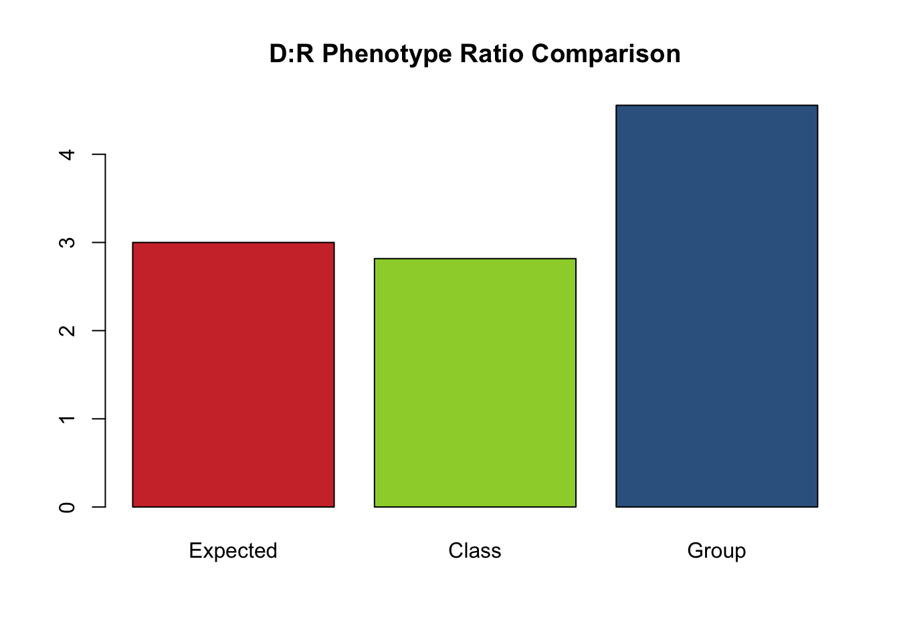

## Sample Size Effects


```r
#Enter 100 samples
fish100<-c(1,10,5,1,7,3,8,5,6,6,2,2,1,8,10,1,5,10,9,10,9,7,1,2,6,6,1,2,1,4,7,8,5,10,1,5,3,5,10,3,9,10,5,2,9,4,6,7,10,5,8,9,7,5,10,9,8,10,1,10,7,10,5,4,6,8,5,10,10,8,2,8,10,7,8,5,6,10,2,9,8,3,7,9,9,9,8,10,10,6,9,4,9,4,2,6,10,2,3,6)

#Enter 80 samples (subset of 100)
fish80<-c(9,7,1,2,6,6,1,2,1,4,7,8,5,10,1,5,3,5,10,3,9,10,5,2,9,4,6,7,10,5,8,9,7,5,10,9,8,10,1,10,7,10,5,4,6,8,5,10,10,8,2,8,10,7,8,5,6,10,2,9,8,3,7,9,9,9,8,10,10,6,9,4,9,4,2,6,10,2,3,6)

#Enter 60 samples  (subset of 80)
fish60<-c(9,10,5,2,9,4,6,7,10,5,8,9,7,5,10,9,8,10,1,10,7,10,5,4,6,8,5,10,10,8,2,8,10,7,8,5,6,10,2,9,8,3,7,9,9,9,8,10,10,6,9,4,9,4,2,6,10,2,3,6)

#Enter 40 samples  (subset of 60)
fish40<-c(10,7,10,5,4,6,8,5,10,10,8,2,8,10,7,8,5,6,10,2,9,8,3,7,9,9,9,8,10,10,6,9,4,9,4,2,6,10,2,3,6)

#Enter 20 samples  (subset of 40)
fish20<-c(10,7,10,5,4,6,8,5,10,10,8,2,8,10,7,8,5,6,10,2,9)


#===============================
# The code below is ready to go!
#===============================

#Create a histogram for each sample size. You can scroll through the results with the small arrows above the plot.  
hist(fish20, breaks=10, main="Fish20Histogram", col=rgb(0.8,0.4,0.1))
```

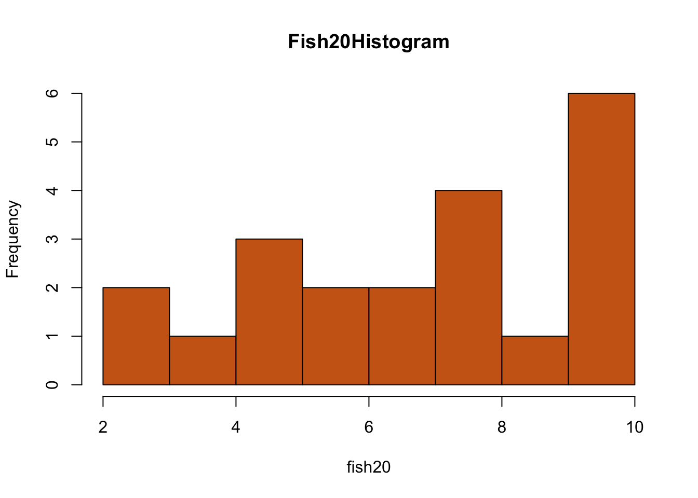

```r
hist(fish40, breaks=10, main="Fish40 Histogram", col=rgb(0.7,0.4,0.1))
```

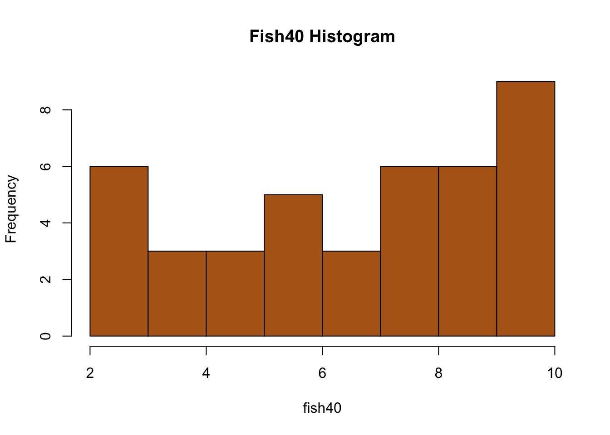

```r
hist(fish60, breaks=10, main="Fish60 Histogram", col=rgb(0.6,0.4,0.1))
```

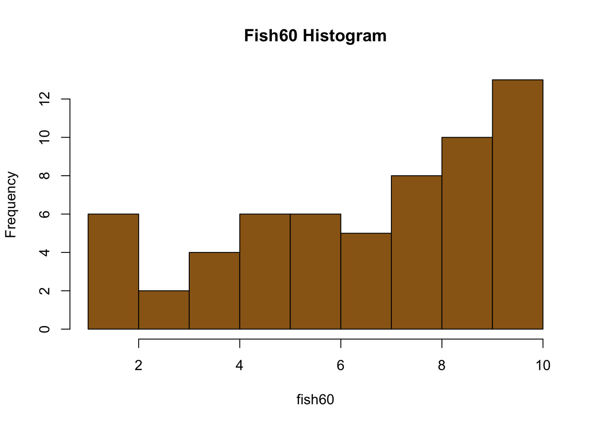

```r
hist(fish80, breaks=10, main="Fish80 Histogram", col=rgb(0.5,0.4,0.1))
```

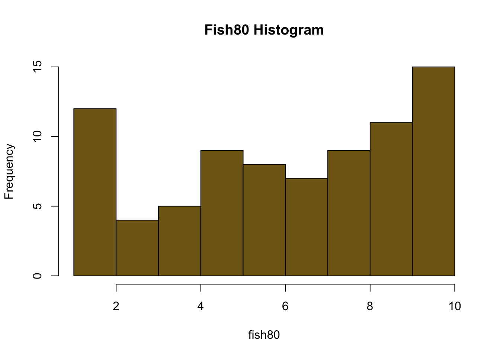

```r
hist(fish100, breaks=10, main="Fish100 Histogram", col=rgb(0.4,0.4,0.1))
```

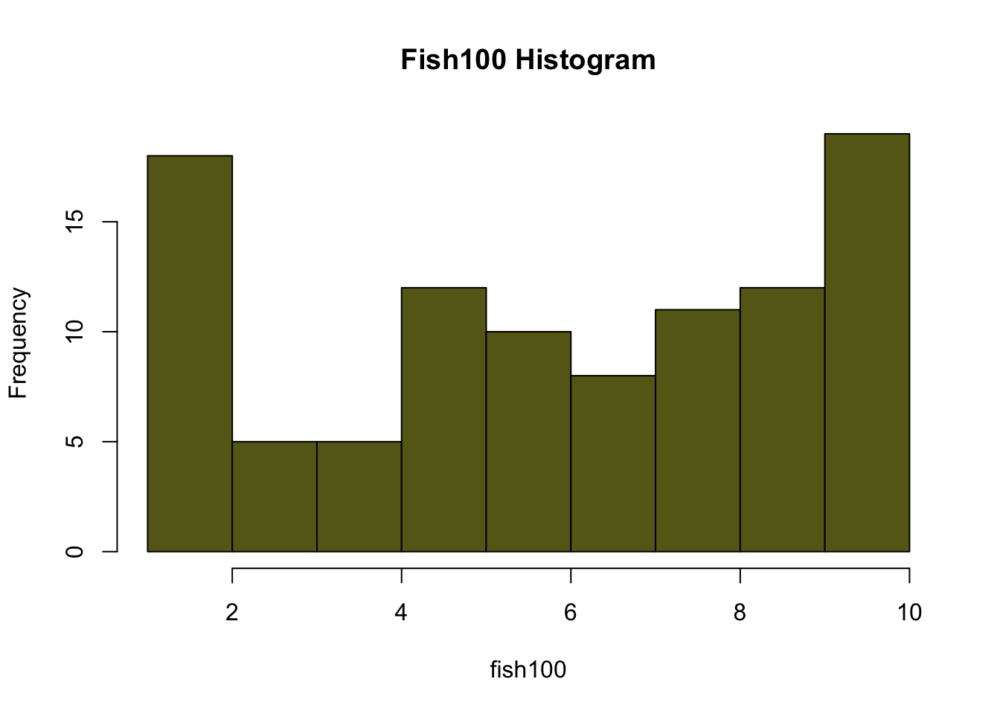

```r
#Calculate the means for each sample size
m20<-mean(fish20)
m40<-mean(fish40) 
m60<-mean(fish60) 
m80<-mean(fish80) 
m100<-mean(fish100) 

#Calculate the Standard Errors for your data sets
se20<-sd(fish20)/sqrt(length(fish20))
se40<-sd(fish40)/sqrt(length(fish40))
se60<-sd(fish60)/sqrt(length(fish60))
se80<-sd(fish80)/sqrt(length(fish80))
se100<-sd(fish100)/sqrt(length(fish100))

#Calculate a confidence interval as your mean plus or minus two times the standard error
ci_low20<-m20-2*(se20)
ci_high20<-m20+2*(se20)

ci_low40<-m40-2*(se40)
ci_high40<-m40+2*(se40)

ci_low60<-m60-2*(se60)
ci_high60<-m60+2*(se60)

ci_low80<-m80-2*(se80)
ci_high80<-m80+2*(se80)

ci_low100<-m100-2*(se100)
ci_high100<-m100+2*(se100)

#Print out everything you need to see with titles you can read easily
cat("Mean 20 = ", m20, "\n")
```

```
## Mean 20 =  7.142857
```

```r
cat("Standard Error 20 = ", se20, "\n")
```

```
## Standard Error 20 =  0.5660461
```

```r
cat("95% Confidence Interval 20 = ", ci_low20, ci_high20, "\n")
```

```
## 95% Confidence Interval 20 =  6.010765 8.274949
```

```r
cat("Mean 40 = ", m40, "\n")
```

```
## Mean 40 =  6.926829
```

```r
cat("Standard Error 40 = ", se40, "\n")
```

```
## Standard Error 40 =  0.41817
```

```r
cat("95% Confidence Interval 40 = ", ci_low40, ci_high40, "\n")
```

```
## 95% Confidence Interval 40 =  6.090489 7.763169
```

```r
cat("Mean 60 = ", m60, "\n")
```

```
## Mean 60 =  6.966667
```

```r
cat("Standard Error 60 = ", se60, "\n")
```

```
## Standard Error 60 =  0.3460566
```

```r
cat("95% Confidence Interval 60 = ", ci_low60, ci_high60, "\n")
```

```
## 95% Confidence Interval 60 =  6.274553 7.65878
```

```r
cat("Mean 80 = ", m80, "\n")
```

```
## Mean 80 =  6.425
```

```r
cat("Standard Error 80 = ", se80, "\n")
```

```
## Standard Error 80 =  0.3254865
```

```r
cat("95% Confidence Interval 80 = ", ci_low80, ci_high80, "\n")
```

```
## 95% Confidence Interval 80 =  5.774027 7.075973
```

```r
cat("Mean 100 = ", m100, "\n")
```

```
## Mean 100 =  6.24
```

```r
cat("Standard Error 100 = ", se100, "\n")
```

```
## Standard Error 100 =  0.3022207
```

```r
cat("95% Confidence Interval 100 = ", ci_low100, ci_high100, "\n")
```

```
## 95% Confidence Interval 100 =  5.635559 6.844441
```

```r
#plot all the means by sample size for easy comparison
allTheMeans<-c(m20,m40,m60,m80,m100)
names<-c("20","40","60","80","100")
barplot(allTheMeans, main="Means by Sample Size", xlab="Sample Size", names.arg=names, ylim=c(0,max(allTheMeans)+1), col=rgb(0.4,0.8,0.1))
```

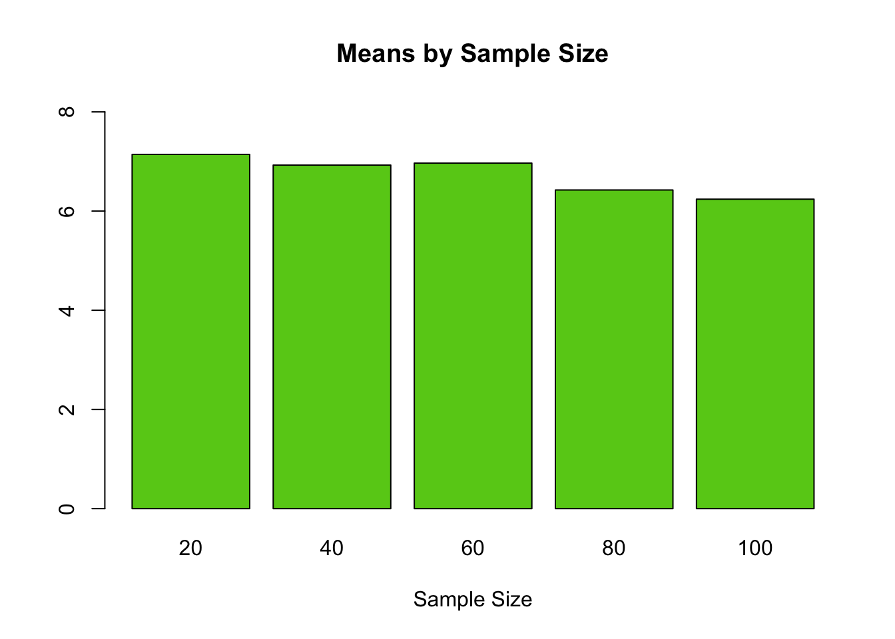

```r
#plot all the standard errors by sample size for easy comparison
allTheSE<-c(se20,se40,se60,se80,se100)
names<-c("20","40","60","80","100")
barplot(allTheSE, main="SE by Sample Size", xlab="Sample Size", names.arg=names, ylim=c(0,max(allTheSE)+1), col=rgb(0.4,0.4,0.6))
```

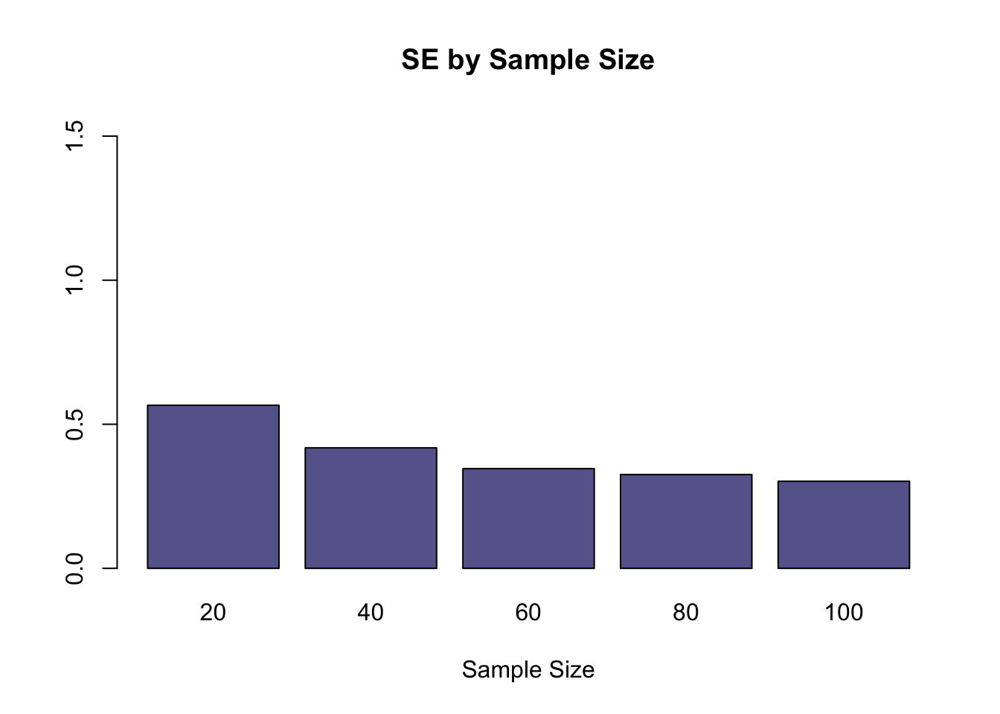

```r
#We can look at the range of each confidence interval by finding the difference bewteen the upper and lower limits. Then we can plot the differences.
#Note: these values are the difference between the upper and lower values of the confidence interval. These values are not the confidence interval. 
ci20<-ci_high20-ci_low20
ci40<-ci_high40-ci_low40
ci60<-ci_high60-ci_low60
ci80<-ci_high80-ci_low80
ci100<-ci_high100-ci_low100

#print out the CI ranges
cat("CI Range 20 = ", ci20, "\n")
```

```
## CI Range 20 =  2.264184
```

```r
cat("CI Range 40 = ", ci40, "\n")
```

```
## CI Range 40 =  1.67268
```

```r
cat("CI Range 60 = ", ci60, "\n")
```

```
## CI Range 60 =  1.384226
```

```r
cat("CI Range 80 = ", ci80, "\n")
```

```
## CI Range 80 =  1.301946
```

```r
cat("CI Range 100 = ", ci100, "\n")
```

```
## CI Range 100 =  1.208883
```

```r
#group the results
allTheCI<-c(ci20,ci40,ci60,ci80,ci100)

#plot all the interval differences by sample size for easy comparison
#allTheSE<-c(ci20,ci40,ci60,ci80,ci100)
names<-c("20","40","60","80","100")
barplot(allTheCI, main="CI Range by Sample Size", xlab="Sample Size", names.arg=names, ylim=c(0,max(allTheCI)+1), col=rgb(0.2,0.4,0.9))
```

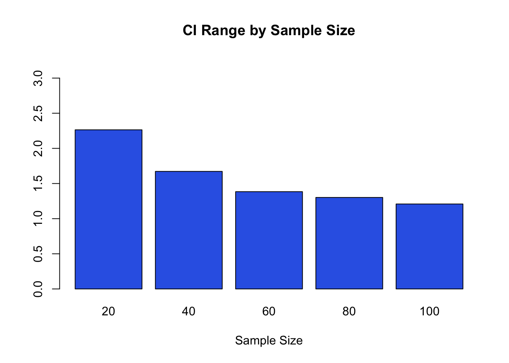

## Phytogenetic Analysis of Gamma Fibrinogen

```r
#Library for Analyses of Phylogenetics and Evolution
library(ape)

#create a list of Genbank Accession Numbers
sequences <- c("U86643", "U86644", "U86645", "U86646","U86647", "U86648", "U86649", "U86650", "U86651", "U86652", "U86653", "U86654", "U86655", "U86656", "U86657", "U86658", "U86659", "U86660", "U86661")

#Retrieve sequence data via GenBank Accession Number
all <- read.GenBank(sequences, species.names=TRUE)

#Get the species names
names<-attr(all, "species")

#Print matrix of data with species names
cbind(attr(all, "species"), names(all))
```

```
##       [,1]                       [,2]    
##  [1,] "Physeter_catodon"         "U86643"
##  [2,] "Physeter_catodon"         "U86644"
##  [3,] "Ailurus_fulgens"          "U86645"
##  [4,] "Ailurus_fulgens"          "U86646"
##  [5,] "Ovis_dalli"               "U86647"
##  [6,] "Alces_alces"              "U86648"
##  [7,] "Giraffa_camelopardalis"   "U86649"
##  [8,] "Tragulus_napu"            "U86650"
##  [9,] "Delphinapterus_leucas"    "U86651"
## [10,] "Physeter_catodon"         "U86652"
## [11,] "Balaenoptera_physalus"    "U86653"
## [12,] "Hexaprotodon_liberiensis" "U86654"
## [13,] "Sus_scrofa"               "U86655"
## [14,] "Pecari_tajacu"            "U86656"
## [15,] "Camelus_dromedarius"      "U86657"
## [16,] "Tapirus_indicus"          "U86658"
## [17,] "Equus_przewalskii"        "U86659"
## [18,] "Crocuta_crocuta"          "U86660"
## [19,] "Canis_latrans"            "U86661"
```

```r
#To standardize sequence lengths, choose the first and last nucleotide number
minLength<-1
maxLength<-424

#truncate all sequences so they are the same length
all$U86643 <- all$U86643[c(minLength:maxLength)]
all$U86644 <- all$U86644[c(minLength:maxLength)]
all$U86645 <- all$U86645[c(minLength:maxLength)]
all$U86646 <- all$U86646[c(minLength:maxLength)]
all$U86647 <- all$U86647[c(minLength:maxLength)]
all$U86648 <- all$U86648[c(minLength:maxLength)]
all$U86649 <- all$U86649[c(minLength:maxLength)]
all$U86650 <- all$U86650[c(minLength:maxLength)]
all$U86651 <- all$U86651[c(minLength:maxLength)]
all$U86652 <- all$U86652[c(minLength:maxLength)]
all$U86653 <- all$U86653[c(minLength:maxLength)]
all$U86654 <- all$U86654[c(minLength:maxLength)]
all$U86655 <- all$U86655[c(minLength:maxLength)]
all$U86656 <- all$U86656[c(minLength:maxLength)]
all$U86657 <- all$U86657[c(minLength:maxLength)]
all$U86658 <- all$U86658[c(minLength:maxLength)]
all$U86659 <- all$U86659[c(minLength:maxLength)]
all$U86660 <- all$U86660[c(minLength:maxLength)]
all$U86661 <- all$U86661[c(minLength:maxLength)]

#change the names in the list
names(all)<-names

#Compute a matrix of pairwise distances from DNA sequences
#raw returns proportion of sites that differ between sequences
#N returns number of sites that differ between sequences
matrix<-dist.dna(all, model="N")

#Run a clustering method
cluster <- hclust(matrix, method="ward.D")

par(cex=0.9, mar=c(13, 3, 1, 1))

#Plot the dendrogram
tree<-plot(as.dendrogram(cluster),horiz=FALSE)
```

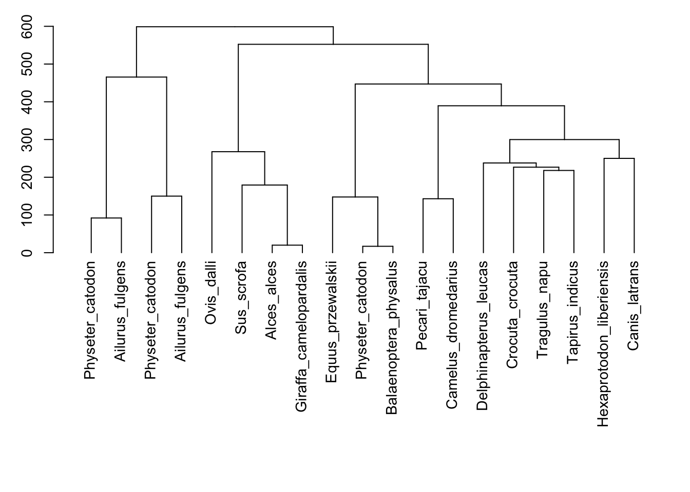

## Genbank Access

```r
#Reference: Molecular Characterization of Echinococcus granulosus Sensu Lato from Farm Animals in Egypt
#http://journals.plos.org/plosone/article?id=10.1371/journal.pone.0118509

#"Little is known on the diversity and public health significance of Echinococcus species in livestock in Egypt. In this study, 37 individual hydatid cysts were collected from dromedary camels (n=28), sheep (n=7) and buffalos (n=2). DNA was extracted from protoscoleces/germinal layer of individual cysts and amplified by PCR targeting nuclear (actin II) and mitochondrial (COX1 and NAD1) genes. Direct sequencing of amplicons indicated the presence of Echinococcus canadenesis (G6 genotype) in 26 of 28 camel cysts, 3 of 7 sheep cysts and the 2 buffalo derived cysts. In contrast, Echinococcus granulosus sensu stricto (G1 genotype) was detected in one cyst from a camel and 4 of 7 cysts from sheep, whereas Echinococcus ortleppi (G5 genotype) was detected in one cyst from a camel. This is the first identification of E. ortleppi in Egypt."

#Library for Analyses of Phylogenetics and Evolution
library(ape)

#create a list of Genbank Accession Numbers
sequences <- c("AB921054", "AB921090", "AB921055", "AB921058","AB921068", "AB921075", "AB921083")

#Retrieve sequence data via GenBank Accession Number
all <- read.GenBank(sequences, species.names=TRUE)

#Get the species names
names<-attr(all, "species")

#Print matrix of data with species names
cbind(attr(all, "species"), names(all))
```

```
##      [,1]                      [,2]      
## [1,] "Echinococcus_granulosus" "AB921054"
## [2,] "Echinococcus_granulosus" "AB921090"
## [3,] "Echinococcus_ortleppi"   "AB921055"
## [4,] "Echinococcus_canadensis" "AB921058"
## [5,] "Echinococcus_canadensis" "AB921068"
## [6,] "Echinococcus_canadensis" "AB921075"
## [7,] "Echinococcus_canadensis" "AB921083"
```

```r
#To standardize sequence lengths, choose the first and last nucleotide number
minLength<-1
maxLength<-384

#truncate all sequences so they are the same length
all$AB921054 <- all$AB921054[c(minLength:maxLength)]
all$AB921090 <- all$AB921090[c(minLength:maxLength)]
all$AB921055 <- all$AB921055[c(minLength:maxLength)]
all$AB921058 <- all$AB921058[c(minLength:maxLength)]
all$AB921068 <- all$AB921068[c(minLength:maxLength)]
all$AB921075 <- all$AB921075[c(minLength:maxLength)]
all$AB921083 <- all$AB921083[c(minLength:maxLength)]

#change the names in the list
names(all)<-names

#Compute a matrix of pairwise distances from DNA sequences
#raw returns proportion of sites that differ between sequences
#N returns number of sites that differ between sequences
matrix<-dist.dna(all, model="N")

#Run a clustering method
cluster <- hclust(matrix, method="ward.D")

par(cex=0.9, mar=c(13, 3, 1, 1))

#Plot the dendrogram
tree<-plot(as.dendrogram(cluster),horiz=FALSE)
```

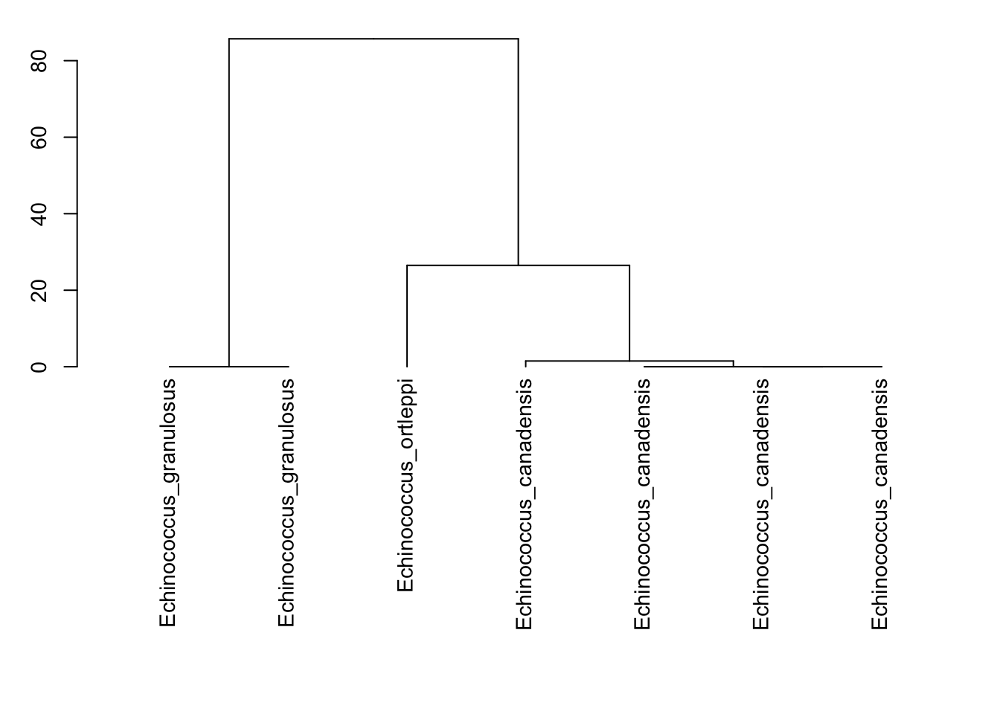

## Gentry Survey Data

```r
#Species per Area plots
#Reference for log transformation interpretation: 
#http://www.ats.ucla.edu/stat/sas/faq/sas_interpret_log.htm

#Area sample sizes; these are common to each sampled area
area<-c(100,200,300,400,500,600,700,800,900,1000)

#Species sampled at each site for each level of area
texas       <-c(7, 12,13,16,16,16,16,16, 16, 16)
penn        <-c(4, 6, 7, 8, 13,15,17,17, 17, 19)
finland     <-c(4, 4, 4, 5, 5, 5, 5, 5,  5,  5)
costaRica   <-c(27,44,62,72,79,85,96,102,112,117)

#log scale transformations
area<-log(area)

#create a plot and add additional point data to it
#set the y axis lower and upper limits
#change the colors and characters for each data set
#set the line type so it shows a line connecting the dots
plot  (area, texas,     col=1,pch=19, type="p", ylab="species count", ylim=c(0,120))
points(area, penn,      col=2,pch=19, type="p")
points(area, finland,   col=3,pch=19, type="p")
points(area, costaRica, col=4,pch=19, type="p")

#Run linear regression models to get lines of best fit 
#Can interpret amount change (number of species/100) per 1% change in area
#so, CR sees about 0.39 species increase per each 1% area increase
regTexas        <-lm(texas~area)
regPenn         <-lm(penn~area)
regFinland      <-lm(finland~area)
regCostaRica    <-lm(costaRica~area)

#plot lines of best fit, colors to match points
abline(regTexas     , col=1)
abline(regPenn      , col=2)
abline(regFinland   , col=3)
abline(regCostaRica , col=4)
```

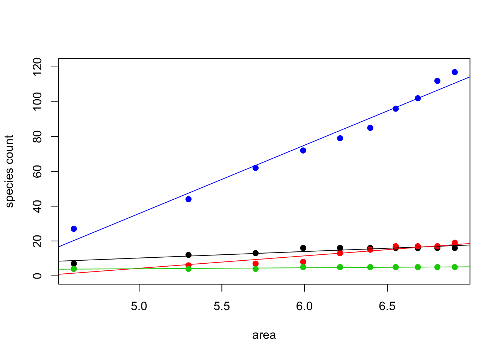

```r
#print summary data from linear regression using log(area)
summary(regTexas)
```

```
## 
## Call:
## lm(formula = texas ~ area)
## 
## Residuals:
##      Min       1Q   Median       3Q      Max 
## -1.74711 -0.86012  0.05576  0.63086  2.06463 
## 
## Coefficients:
##             Estimate Std. Error t value Pr(>|t|)    
## (Intercept)  -8.4880     3.5217  -2.410  0.04249 *  
## area          3.7425     0.5722   6.541  0.00018 ***
## ---
## Signif. codes:  0 '***' 0.001 '**' 0.01 '*' 0.05 '.' 0.1 ' ' 1
## 
## Residual standard error: 1.258 on 8 degrees of freedom
## Multiple R-squared:  0.8425,	Adjusted R-squared:  0.8228 
## F-statistic: 42.79 on 1 and 8 DF,  p-value: 0.0001802
```

```r
summary(regPenn)
```

```
## 
## Call:
## lm(formula = penn ~ area)
## 
## Residuals:
##     Min      1Q  Median      3Q     Max 
## -3.4146 -0.4031  0.3181  0.9616  2.4717 
## 
## Coefficients:
##             Estimate Std. Error t value Pr(>|t|)    
## (Intercept) -31.3134     5.2508  -5.964 0.000337 ***
## area          7.1315     0.8531   8.360 3.18e-05 ***
## ---
## Signif. codes:  0 '***' 0.001 '**' 0.01 '*' 0.05 '.' 0.1 ' ' 1
## 
## Residual standard error: 1.876 on 8 degrees of freedom
## Multiple R-squared:  0.8973,	Adjusted R-squared:  0.8844 
## F-statistic: 69.88 on 1 and 8 DF,  p-value: 3.178e-05
```

```r
summary(regFinland)
```

```
## 
## Call:
## lm(formula = finland ~ area)
## 
## Residuals:
##      Min       1Q   Median       3Q      Max 
## -0.46670 -0.13383  0.01548  0.15191  0.37033 
## 
## Coefficients:
##             Estimate Std. Error t value Pr(>|t|)   
## (Intercept)   1.2355     0.7326   1.687  0.13018   
## area          0.5665     0.1190   4.760  0.00143 **
## ---
## Signif. codes:  0 '***' 0.001 '**' 0.01 '*' 0.05 '.' 0.1 ' ' 1
## 
## Residual standard error: 0.2617 on 8 degrees of freedom
## Multiple R-squared:  0.739,	Adjusted R-squared:  0.7064 
## F-statistic: 22.66 on 1 and 8 DF,  p-value: 0.001427
```

```r
summary(regCostaRica)
```

```
## 
## Call:
## lm(formula = costaRica ~ area)
## 
## Residuals:
##    Min     1Q Median     3Q    Max 
## -5.651 -3.303 -1.064  4.079  6.732 
## 
## Coefficients:
##             Estimate Std. Error t value Pr(>|t|)    
## (Intercept) -160.630     13.584  -11.82 2.40e-06 ***
## area          39.281      2.207   17.80 1.02e-07 ***
## ---
## Signif. codes:  0 '***' 0.001 '**' 0.01 '*' 0.05 '.' 0.1 ' ' 1
## 
## Residual standard error: 4.853 on 8 degrees of freedom
## Multiple R-squared:  0.9754,	Adjusted R-squared:  0.9723 
## F-statistic: 316.8 on 1 and 8 DF,  p-value: 1.017e-07
```


