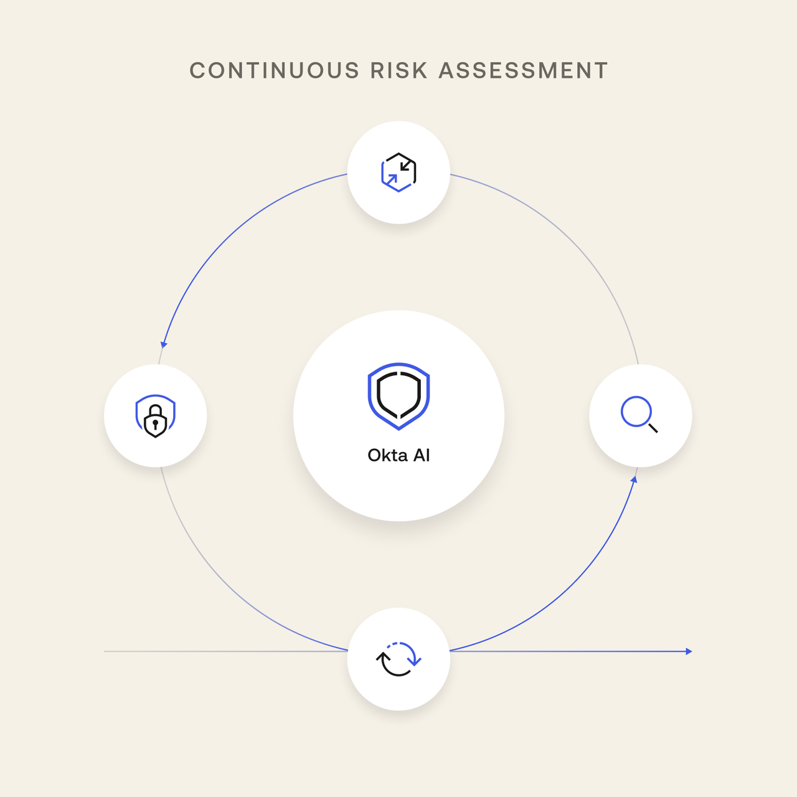

## Overview 

:::: {.columns}

::: {.column width="40%"}

#### Purpose

Learn about Okta's AI-driven **[Identity Threat Protection](https://www.okta.com/products/identity-threat-protection/)** product! 

{fig-align="center" width=60%}

:::

::: {.column width="60%"}
#### Objectives

- Review **key concepts** 
- Increase **familiarity** with the product
- Identify how ITP provides **value for customers**
- Differentiate Okta's **ITP vs competing products**
- Wrap up in **15m**

:::

::::

::: {.notes}
Overview speaker notes
:::

## Glossary: Fundamentals

::: {.glossary-container}

::: {.glossary-item}

Identity

The **unique digital profile** of an employee, device, or app trying to log in and access company data.

:::

::: {.glossary-item}

Identity Signals

**Real-time contextual clues** like a user's location, typing patterns, or IP address that are analyzed during a login attempt.

:::

::: {.glossary-item}

Pattern Detection

Using AI to instantly spot **unusual activity** by comparing a user's current login signals against their normal everyday habits.

:::

::: {.glossary-item}

Device Health

Continuous, automatic verification that a laptop or phone is **fully updated and secure** before letting it connect to the network.

:::

::: {.glossary-item}

Multi-factor Authentication (MFA)

A **multi-step login process** that often requires tapping a prompt on a secure authenticator app.

:::

::: {.glossary-item}

Token Theft

A modern cyberattack where hackers steal the digital "VIP pass" left in a user's browser, allowing them to **bypass MFA entirely**.

:::

::: {.glossary-item}

Sessions: Hijacking & Termination

When a hacker uses a stolen digital pass (🍪) to impersonate a live user, requiring a **global "kill switch"** to instantly force a logout across all apps.

:::

::: {.glossary-item}

Workflows

Digital playbooks that instantly trigger **automated safety actions** the moment a threat is spotted.

:::

:::

<!-- Clickable Popup Panel -->

  
Your turn 🤔

  

    - What is one work system you accessed today?
    - If I had your password, would that be enough for me to get your files?
  

## What's in it for Me? {style="font-size: 60%;"}

##### Pipeline Generation

Use ITP to knock on a CISO's door and challenge their post-login security blind spots. Assuming they have legacy IAM tech, probe their real-time capabilities across a complex ecosystem.

##### Territory Planning

ITP centers your territory vision around an urgent threat (session hijacking), giving you a high-intent narrative to open enterprise accounts quickly.

##### Revenue Performance

Attaching ITP to your core deals is how you land sticky deals and nail quotas quickly.

##### Value-Based Positioning

ITP lets you sell high-level business value to execs for a big-picture narrative: stopping threats cold at scale in a complex system.

##### Ecosystem Orchestration

Building pipeline is a team sport and ITP gives your front line an aggressive, disruptive hook for outbound prospecting and gives your channel partners a massive financial incentive to help you uncover hidden opportunities.

## Product Overview

#### The Problem
User identity is a leading attack target. You can tell customers that [80%](https://www.verizon.com/business/resources/reports/2024-dbir-data-breach-investigations-report.pdf) of data breaches are associated with attacks on identity. 

> Why break through the wall if you can walk through the front door?

## Product Overview

#### The Intervention

- 🗘 ITP **continuously monitors** user sessions across customer tech stacks
- 🧠 AI-driven processes look for **anomalous patterns** in user behavior and device activity
- ❌ Threats are stopped **in real time** across complex tech ecosystems

## Product Overview

#### Advanced Capabilities

- Extended detection and response to gather clues from the **entire tech ecosystem**
- An advanced **cloud security** layer between employees and remote systems
- Real-time **device and hardware monitoring** and security

<!-- Clickable Popup Panel -->

  
Your turn 🤔

  

    - How does AI play a role in ITP?
    - What is the benefit of continuous monitoring and automatic security actions?
  

## Competition {vertical-align="middle"}

| Competitor | Architectural Approach | | Key Differentiator Notes |
|:---|:---|:---|:---|
| {fig-align="center"}   **Microsoft Entra ID** | **Ecosystem-Centric:** Real-time termination works well, but is heavily restricted to native M365 and Azure environments. | **The Vendor-Neutral Identity Hub:** Okta ITP evaluates and orchestrates risk across all major cloud apps simultaneously. | **Cross-SaaS Remediation:** Okta severs access across M365, Salesforce, and AWS instantly via the Shared Signals Framework (SSF). Entra struggles to kill non-Microsoft sessions immediately. |
| {fig-align="center"}   **CrowdStrike Falcon** | **Endpoint-Centric:** Focuses deeply on machine-level lateral movement and credential dumping. Relies heavily on an installed agent. | **True Identity Context:** Okta doesn't care if an endpoint is managed or unmanaged. It secures the identity boundary at the app layer. | **Unmanaged Device Security:** Falcon is blinded if an attacker steals a token from a personal BYOD laptop. Okta catches token theft via behavior and network context. |
| {fig-align="center"}   **PingOne Identity** | **On-Prem Legacy / Heavy Orchestration:** Relies on highly complex, manual workflow builders to configure basic remediation tracks. | **Out-of-the-Box Value:** Okta ITP provides native, automated continuous access monitoring without multi-month engineering deployments. | **Operational Simplicity:** Ping is bogged down by legacy architecture and massive engineering overhead. Okta provides a sleek, cloud-native policy engine. |
| {fig-align="center"}   **SentinelOne Singularity**| **Deception & AD Focus:** Built for Active Directory defense, setting up honeypot credentials, and protecting on-prem endpoints. | **Cloud-First Workforce Protection:** SentinelOne protects the infrastructure; Okta protects the SaaS layer where modern business actually happens. | **SaaS Session Hijacking:** Modern threats have shifted from AD domain controllers to SaaS cookie hijacking. Okta intercepts cloud-level session deviations. |

: {tbl-colwidths="[25,25,25,25]"}

## Advantages {auto-animate=true}

#### Universal Kill Switch

When access is compromised, Okta can sever access across an entire ecosystem instantly.

## Advantages {auto-animate=true}

#### Universal Kill Switch

When access is compromised, Okta can sever access across an entire ecosystem instantly.

#### Neutrality is Security

Okta checks every transaction across multi-cloud environments, avoiding a single-vendor point of failure.

## Advantages {auto-animate=true}

#### Universal Kill Switch

When access is compromised, Okta can sever access across an entire ecosystem instantly.

#### Neutrality is Security

Okta checks every transaction across multi-cloud environments, avoiding a single-vendor point of failure.

#### Session Security

Okta ITP protects the user session itself, making it highly effective against session hijacking and token theft.

::: {.notes}
speaker notes
:::

## Key Takeaways

- Okta's ITP is all about continuous full-ecosystem awareness, AI-driven automatic detection, and the universal lockout capability to negate high-risk threats. 

- Your ICP is enterprise and strategic accounts with complex tech and high-value information at risk.    

## 90-Day Action Plan

##### **Phase 1: Days 1–30 | The Identity Gap Map**
*   **Action:** Audit your net-new territory to isolate companies using Microsoft, Salesforce, AWS, and Slack. 
*   **Target:** Focus on high-BYOD and contractor-heavy verticals where token theft is lethal.

## 90-Day Action Plan

##### **Phase 2: Days 31–60 | The Post-Login Outbound Blitz**
*   **Action:** Arm your xDRs with this hook: *MFA protects the front door after breakfast, but how do you stop a stolen session after lunch?*
*   **Value:** Pivot cold outreach away from utility features to the high-level business value of a "Universal Kill Switch."

## 90-Day Action Plan

##### **Phase 3: Days 61–90 | Run the "3-Minute Panic"**
*   **Action:** Execute a micro-simulation in live discovery to expose competitor ecosystem lock-in.
*   **Outcome:** Refuse to land small; leverage the security conversation to scope multi-product ARR deals from day one.

## Live Simulation Activity  {style="font-size: 70%;"}

Goal: help your prospect confront a high-stakes security blind spot in real time.

1. Pair up as Sellers and Prospects
- Prospects: CISO at a large company with many contractors; happily using Microsoft Entra ID & Defender with MFA for corporate hardware login. Also using Salesforce, AWS, and Slack. Defender flags the malware, Entra revokes access.
- Sellers: Probe their capability to defend against a post-login token theft across non-MS systems and BYOD devices.

## Live Simulation Activity  {style="font-size: 70%;"}

2. Talk tracks:

Opener:

::: {.fragment .custom .blur}
*MFA protects the front door after breakfast, but how do you stop a stolen session after lunch?*
:::

Okta vs Microsoft:

::: {.fragment .custom .blur}
*If a token is hijacked, Okta isn't hindered in a MS environment and we instantly trigger a Universal Logout everywhere simultaneously to neutralize the threat. Defender and Entra simply cannot natively kill active sessions across your other systems with that same speed.*
:::

## Enablement Impact  {style="font-size: 80%;"}

- A measurable lift in day-one **seller confidence** and **technical fluency** when positioning Okta ITP against complex, heavy-Microsoft security architectures.

- Conversational Intelligence analytics tracking a targeted **2x** spike in AEs actively leveraging the "BYOD token-theft scenario" and "Universal Kill Switch" hooks during live discovery.

- A direct increase in net-new discovery calls secured and qualified with **complex, multi-vendor enterprise** accounts.

- **Higher ITP attach rates** preventing small, single-product utility agreements and maximizing revenue performance per deal.

- Upward trend in **enterprise accounts using ITP** as a percentage of the overall net-new client base, accelerating your territory’s long-term ARR growth.

## Time to Crush It! 

:::: {.columns}

::: {.column width="50%"}
#### Additional Resources

- [ITP Product Page](https://www.okta.com/products/identity-threat-protection/)
- [Blog](https://www.okta.com/blog/2024/08/identity-threat-protection-with-okta-ai-is-generally-available/) 
- [Datasheet](https://www.okta.com/resources/datasheet-strengthen-your-security-posture-with-okta-ai/)
- [Webinar](https://www.okta.com/webinars/hub/a-security-imperative-identity-threat-visibility-and-remediation-with-crowdstrike/)
- [ITP Overview w/ Jo Raghunathan](https://www.youtube.com/watch?v=XbI-JeRJPm4&t=33m06s)
:::

::: {.column width="50%"}
#### Competitor Product Pages

- [Microsoft Entra ID](https://www.microsoft.com/en-us/security/business/identity-access/microsoft-entra-id)
- [CrowdStrike Falcon](https://www.crowdstrike.com/en-us/platform/)
- [Ping Identity](https://www.pingidentity.com/en/platform/pingone-for-workforce.html)
- [SentinelOne ](https://www.sentinelone.com/platform/identity/)
:::

::::

